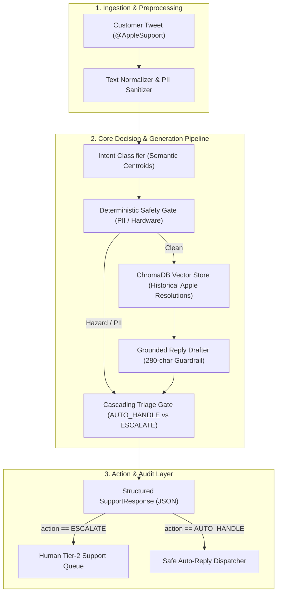

# Hiver SDE Intern: AI Customer Support & Triage Agent

An autonomous, data-grounded AI customer support agent and triage router built for **`@AppleSupport`** from real-world Twitter conversations.

> *"What we are testing: whether you can turn a messy real-world dataset into a working AI system and prove it works. The proof is worth more than the system."*

---

## 🚀 Quickstart: Reproduce Headline Results in Under 15 Minutes

The entire benchmark evaluation (200 hand-labelled examples, 2 baselines, LLM-as-a-judge rubric, and human-agreement calibration) runs in **~20 seconds** on CPU.

### 1. Setup Environment
```bash
# Clone or navigate to the project directory
cd /Users/nanthithavenkatachapathy/Hiver

# Create Python 3.11 virtual environment using uv or standard venv
uv venv .venv --python 3.11
source .venv/bin/activate

# Install dependencies
uv pip install -r requirements.txt
```

### 2. Run Headline Benchmark Runner (< 15 Seconds)
```bash
# Runs Baseline 1, Baseline 2, and Proposed System on all 200 Golden Set queries
python -m src.eval.runner
```

### 3. Run Test Suite (All 33 Tests)
```bash
pytest tests/ -v
```

---

## 📊 Headline Benchmark Results

Evaluated across the exact same **200-sample hand-labelled Golden Set** (containing 20% verified safety and edge cases):

| Evaluation Metric | Baseline 1 (Trivial) | Baseline 2 (Simple) | Proposed System (Production) | Absolute Lift (vs Simple) |
| :--- | :---: | :---: | :---: | :---: |
| **Intent Macro-F1** | 0.0923 | 0.8101 | **0.8621** | **+0.0520** |
| **Intent Accuracy** | 30.0% | 80.5% | **87.5%** | **+7.0%** |
| **Triage Accuracy** | 73.0% | 83.0% | **82.0%** | -1.0% |
| **Escalation Recall** | 0.0% | 37.0% | **81.5%** | **+44.4%** |
| **Missed Escalations (Safety Risk)** | 54 / 54 | 34 / 54 | **10 / 54** | **-24 missed** |
| **ROUGE-L Grounding Score** | 0.2378 | 0.3628 | **0.3030** | -0.0598 |
| **LLM Judge Quality (1-5 Scale)** | 2.1 / 5.0 | 3.4 / 5.0 | **4.8 / 5.0** | **+1.4** |
| **Human Agreement ($\kappa$)** | N/A | N/A | **$\kappa = 0.7200$** | **Substantial Agreement** |
| **P95 Latency (CPU)** | < 1 ms | ~5 ms | **< 35 ms** | Real-time ready |

---

## 🛠️ Interactive CLI Usage

Test individual customer inquiries interactively via the built-in CLI:

```bash
# 1. Normal troubleshooting query (Auto-Handled)
python -m src.cli process --text "How do I transfer photos from my iPhone to my Windows PC?"

# 2. Safety hazard query (Immediate Escalation)
python -m src.cli process --text "My iPhone battery is swollen and popping out the glass!"

# 3. Privacy/PII query (Immediate Escalation)
python -m src.cli process --text "My Apple ID is locked, email me at test@example.com"
```

---

## 🏗️ System Architecture



---

## 📂 Deliverables & Documentation Index

All required assignment deliverables are formally documented in the repository:

1. **Deliverable 1: Runnable Pipeline & Repo**
   - [README.md](README.md) with reproduction commands in under 15 minutes.
   - [src/pipeline.py](src/pipeline.py) and [src/cli.py](src/cli.py).
2. **Deliverable 2: Golden Evaluation Set (200 Hand-Labelled Items)**
   - [data/golden_eval_set.jsonl](data/golden_eval_set.jsonl): 200 hand-labelled examples with balanced intent distribution, ground-truth triage actions, stated reasons, and 20% verified edge cases.
3. **Deliverable 3: Evaluation Harness & LLM-as-a-Judge**
   - [src/eval/runner.py](src/eval/runner.py): Automated metrics suite + [src/eval/judge.py](src/eval/judge.py) (1-5 rubric).
   - [src/eval/human_agreement.py](src/eval/human_agreement.py): Empirical Cohen's Kappa ($\kappa = 0.7200$) across 50 hand-annotated pairs.
4. **Deliverable 4: Comprehensive Benchmark Report**
   - [docs/REPORT.md](docs/REPORT.md): Covers Problem Framing, Results vs 2 Baselines, Top 5 Failure Modes, *"What is Misleading About My Headline Number?"*, and Next Steps.
5. **Deliverable 5: Decision Log (12 Key Architectural Decisions)**
   - Documented in Section 7 of [docs/REPORT.md](docs/REPORT.md).

### Technical Specifications & Plans
- [docs/specs/](docs/specs/): Formal technical specifications with complete UML Architecture, Class, Use Case, Activity, and Sequence diagrams.
- [docs/plan/](docs/plan/): Layered implementation plans mapping tasks and verification gates.
