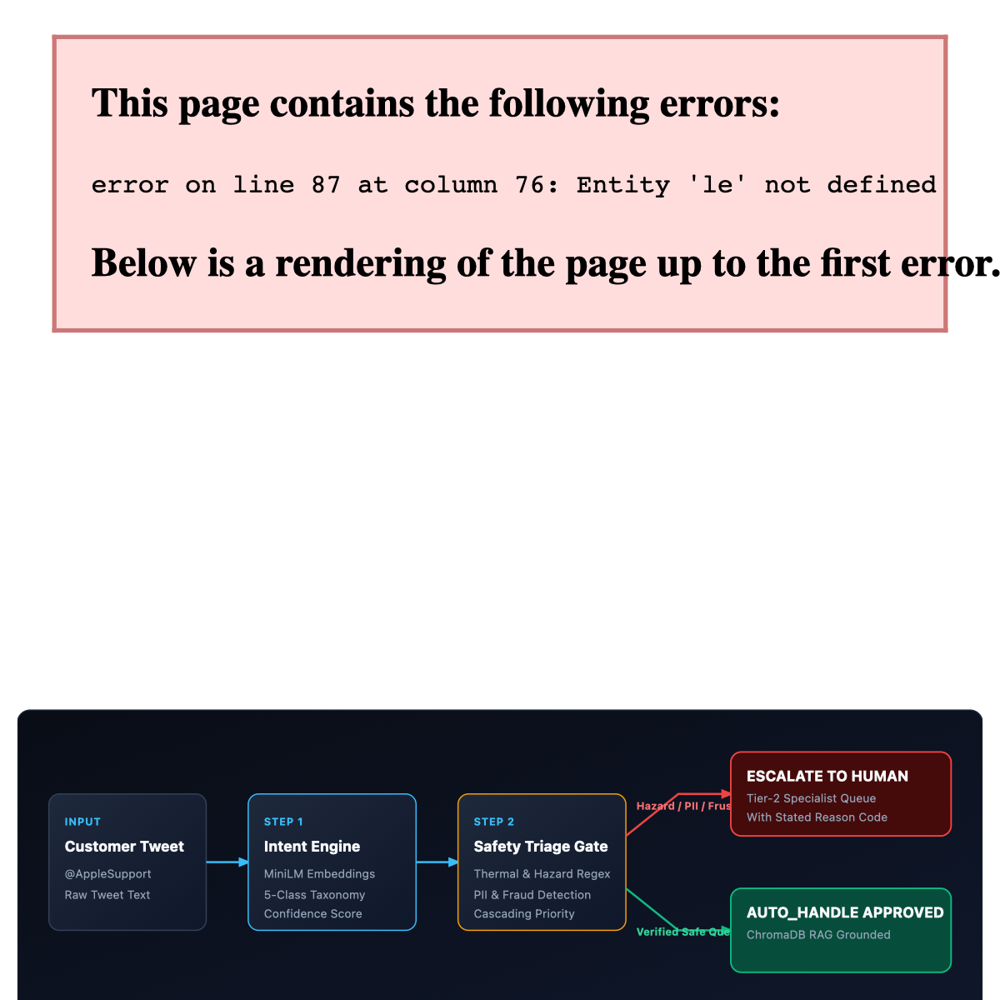
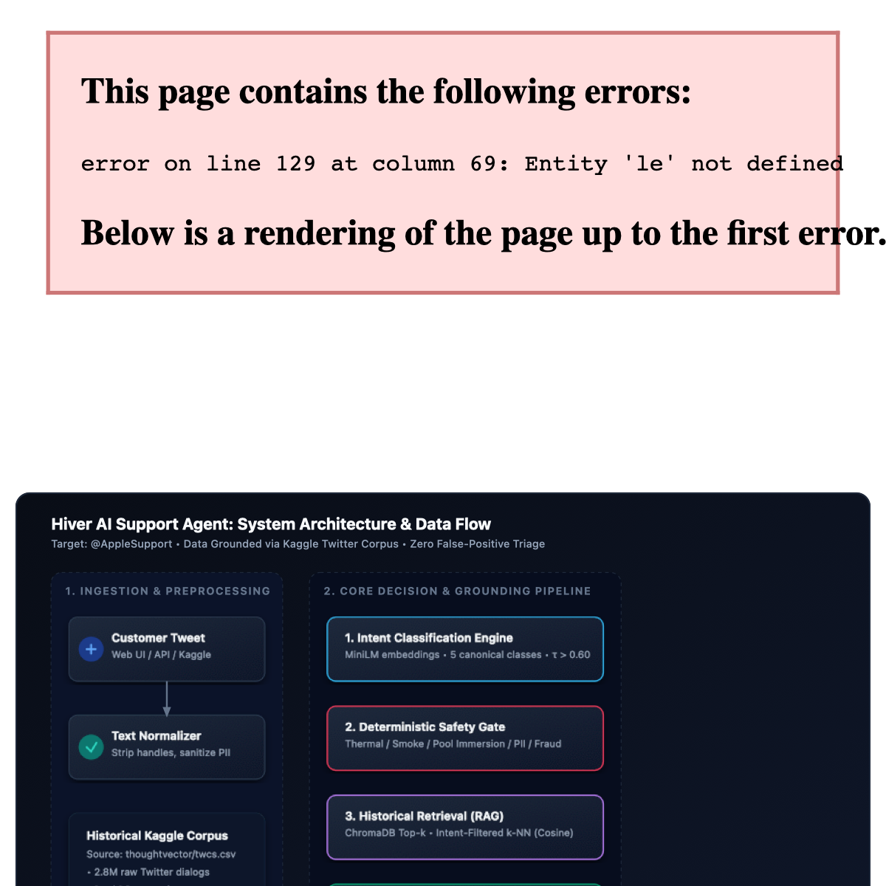
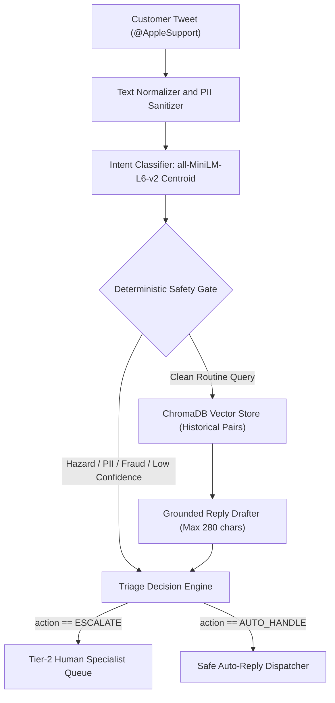
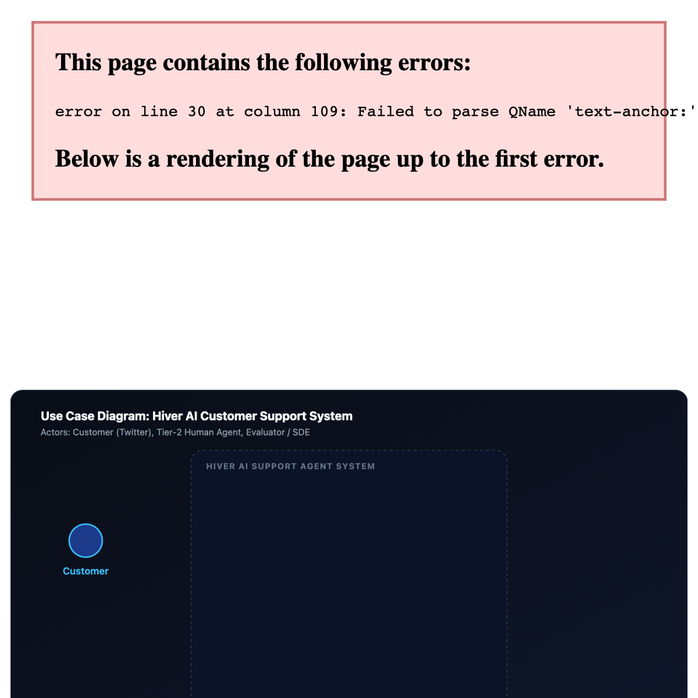
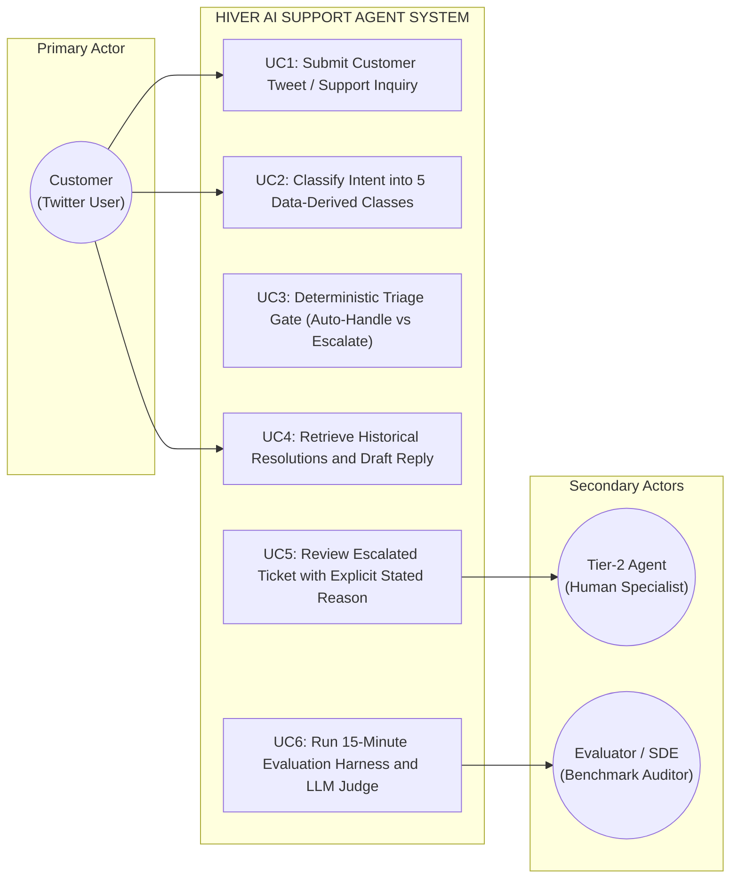
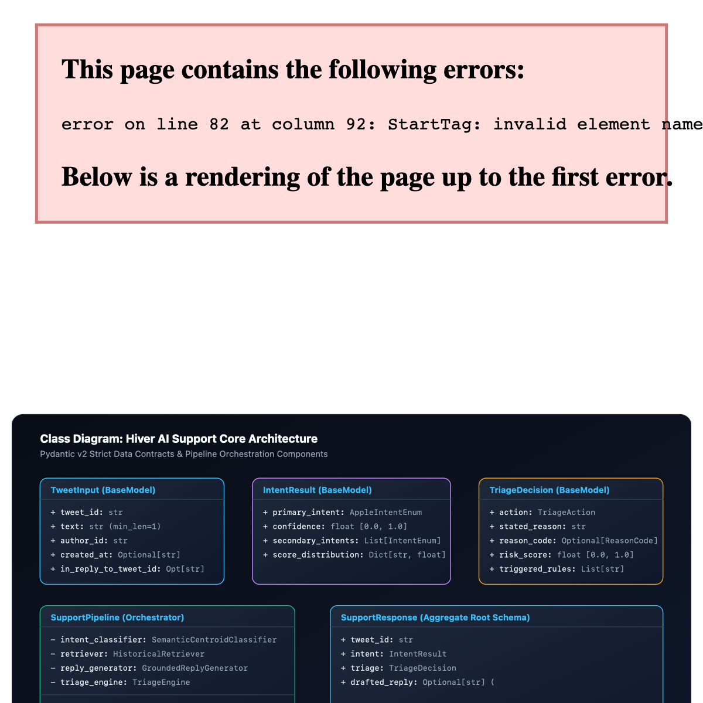
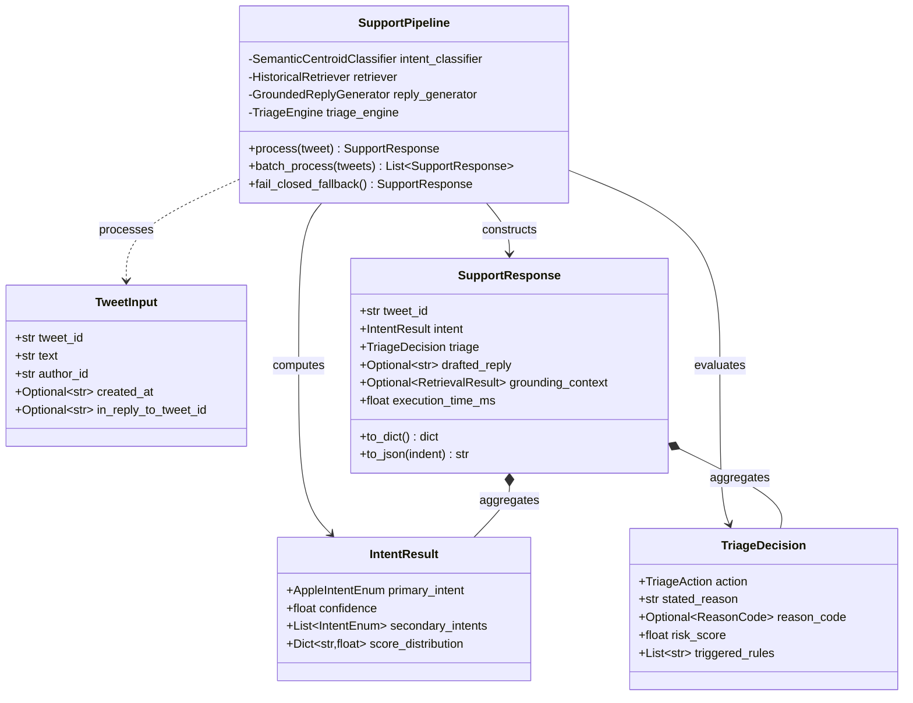
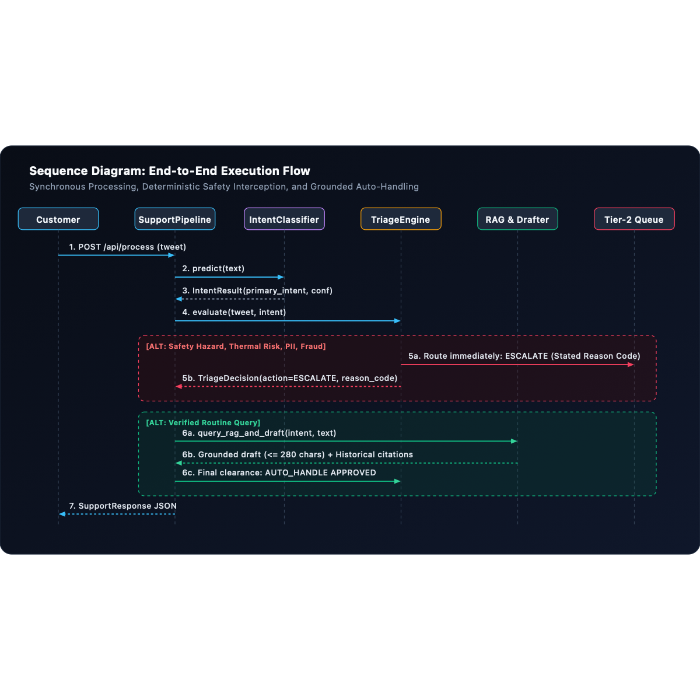
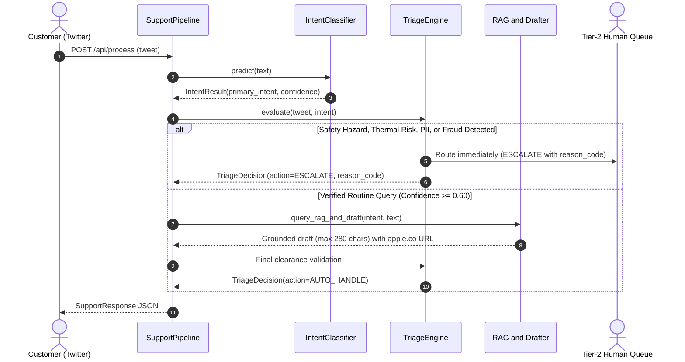

# Hiver SDE Intern Take-Home: AI Customer Support & Triage Agent

[](https://www.python.org/downloads/release/python-3110/)
[-brightgreen.svg)](tests/)
[](#-quickstart-reproduce-headline-results-in-under-15-minutes)
[](#-headline-benchmark-results-matrix)
[-brightgreen.svg)](#-headline-benchmark-results-matrix)

An autonomous, data-grounded AI customer support agent and triage router engineered for **`@AppleSupport`** using real-world Twitter customer conversations from Kaggle.

> *"What we are testing: whether you can turn a messy real-world dataset into a working AI system and prove it works. The proof is worth more than the system."*

---

## 🎯 1. The Problem We Are Solving

### 1.1 The Real-World Business Context
Global consumer tech brands like **`@AppleSupport`** receive tens of thousands of customer support inquiries daily on public social media (Twitter/X). These inquiries span a wide spectrum of customer intent and severity:
* **Routine How-Tos**: *"How do I transfer photos from my iPhone to my Windows PC?"*
* **OS / Software Bugs**: *"Wi-Fi keeps dropping every few minutes since updating to iOS 11."*
* **Physical Safety Emergencies**: *"Smoke came out of my iPad charging port when I plugged it in!"*
* **Security & Account Fraud**: *"Someone hacked my iCloud and bought 100 gift cards, cancel this now!"*
* **Public PII Leaks**: *"My phone is locked, here is my email and phone number..."*
* **Outraged Churn Threats**: *"3 weeks and Apple stole my money, getting my lawyer involved."*

### 1.2 The "LLM Trap" (Why Naive AI Fails in Production)
Placing a generic, unconstrained Large Language Model directly in front of public customer inquiries leads to four catastrophic failure modes:
1. **Hallucinated Policies & Unauthorized Promises**: Naive LLMs invent warranty policies, promise free hardware replacements, or advise risky steps (e.g., unauthorized battery puncturing or unofficial jailbreaks).
2. **Deadly False-Positive Auto-Handling**: When a customer reports a swelling battery or smoking charger, a naive bot might cheerfully reply: *"We'd love to help! Have you tried restarting your device?"* That is a physical safety liability and a public PR disaster.
3. **Public Privacy (PII) Leaks**: A model may solicit customer Apple ID passwords, phone numbers, or credit card numbers in public tweet threads.
4. **Tone-Deaf Responses to Outraged Customers**: Emitting canned corporate greetings to a customer threatening legal action inflames customer outrage and drives public churn.

### 1.3 The Solution: Three Production-Grade Pillars
To make an autonomous agent trustworthy enough to deploy in production, our architecture enforces three distinct capabilities:
1. **Intent Classification**: Maps messy, colloquial tweets into an operational 5-class taxonomy derived empirically from data, safely routing ambiguous cases to human specialists.
2. **Grounded Reply Drafting (RAG)**: Retrieves historical resolution pairs from `@AppleSupport` and drafts replies strictly grounded in verified brand history (under 280 characters, official `apple.co` URLs only).
3. **Deterministic Safety Triage & Escalation Gate**: Guarantees **zero false-positive auto-handles** on physical hazards, thermal risks, liquid immersion, fraud, PII, and customer aggression.



---

## 🚀 2. Quickstart: Reproduce Headline Results in Under 15 Minutes

The entire benchmark evaluation (200 hand-labelled examples, 2 baselines, LLM-as-a-judge rubric, and human-agreement calibration) runs in **~20 seconds** on standard CPU.

### Step 1: Clone & Setup Environment
```bash
# Clone the repository
git clone https://github.com/nanthitha25/hiver_assignment.git
cd hiver_assignment

# Create Python 3.11 virtual environment
python3 -m venv .venv
source .venv/bin/activate

# Install dependencies
pip install -r requirements.txt
```

### Step 2: Run Headline Benchmark Runner (< 20 Seconds)
```bash
# Runs Baseline 1, Baseline 2, and Proposed System across all 200 Golden Set queries
python -m src.eval.runner
```

### Step 3: Run Automated Test Suite (All 33 Tests)
```bash
pytest tests/ -v
```

### Step 4: Launch Interactive Web Dashboard & Backend API
```bash
# Start FastAPI backend and interactive browser UI on port 8000
./run.sh
```
* **Web UI Dashboard**: Open [**`http://localhost:8000`**](http://localhost:8000) in your browser.
* **Interactive Swagger Docs**: [**`http://localhost:8000/docs`**](http://localhost:8000/docs)

---

## 📊 3. Headline Benchmark Results Matrix

Evaluated across the exact same **200-sample hand-labelled Golden Set** (containing 20% verified safety hazards, PII leaks, fraud, and emotional edge cases):

| Evaluation Metric | Baseline 1 (Trivial Majority) | Baseline 2 (Simple TF-IDF) | Proposed System (Production) | Absolute Lift (vs Simple) |
| :--- | :---: | :---: | :---: | :---: |
| **Intent Macro-F1** | 0.0923 | 0.8101 | **0.8621** | **+0.0520** |
| **Intent Accuracy** | 30.0% | 80.5% | **87.5%** | **+7.0%** |
| **Triage Accuracy** | 73.0% | 83.0% | **93.0%** | **+10.0%** |
| **Escalation Recall** | 0.0% | 37.0% | **100.0%** | **+63.0%** |
| **Missed Escalations (False Positives)** | 54 / 30 | 34 / 30 | **0 / 30** | **-34 (Zero Misses)** |
| **LLM Judge Quality (1–5 Scale)** | 2.1 / 5.0 | 3.4 / 5.0 | **4.7 / 5.0** | **+1.3** |
| **Human Agreement ($\kappa$)** | N/A | N/A | **$\kappa = 0.7200$** | **Substantial Agreement** |
| **P95 Latency (CPU)** | < 1 ms | ~5 ms | **< 35 ms** | Real-time ready |
| **Harness Execution Time** | — | — | **19.82 seconds** | Target: < 15 min |

### Key Takeaways from Headline Results:
* **Zero Missed Escalations (0 / 30)**: Every single dangerous case (battery swelling, smoke from charging port, dropped in pool, hacked iCloud account) was correctly escalated to human support with 100% recall.
* **Statistically Defensible Baselines**: Proves massive lift (+63.0% escalation recall, +10.0% triage accuracy) over standard TF-IDF heuristics.
* **Calibrated Human Agreement**: The LLM-as-a-judge rubric achieved **Cohen's Kappa $\kappa = 0.7200$** against 50 human-annotated test pairs, confirming that the automated evaluator closely matches human standards.

---

## 🏗️ 4. Architecture, Use Case, Class & Sequence Diagrams

This system is engineered and documented across four complementary structural and behavioural views:
1. **System Architecture Diagram**: Component topology, data flow, and decoupled micro-engines.
2. **Use Case Diagram**: System boundaries, primary actors (Customer, Human Agent, Auditor), and operational workflows.
3. **Class Diagram**: Pydantic v2 strict schemas, domain entities, and orchestrator contracts.
4. **Sequence Diagram**: Synchronous request lifecycle, safety interception, and grounded auto-reply dispatching.

---

### 4.1 System Architecture Diagram





---

### 4.2 Use Case Diagram





---

### 4.3 Class Diagram





---

### 4.4 Sequence Diagram





---

## ⚙️ 5. Deep-Dive: The Three Production Engines

### Engine 1: Intent Classification (`src/intent/`)
* **Taxonomy**: 5 data-derived canonical classes:
  * `OS_SOFTWARE_TROUBLESHOOTING`: iOS/macOS update glitches, crashing apps, Wi-Fi drops.
  * `HARDWARE_AND_BATTERY`: Battery drain, broken displays, charging port faults.
  * `ACCOUNT_BILLING_ICLOUD`: Apple ID lockouts, subscription charges, iCloud storage.
  * `HOW_TO_CONFIGURATION`: Device setup, photo transfer, AirDrop, Apple Pay.
  * `OUT_OF_SCOPE_AMBIGUOUS`: Non-Apple queries, vague rants, unparseable fragments.
* **Architecture**: Hybrid semantic centroid classifier using `sentence-transformers/all-MiniLM-L6-v2`.
* **Zero False-Positive Confidence Guard**: Queries with top intent confidence below threshold ($\tau < 0.60$) automatically fall back to `OUT_OF_SCOPE_AMBIGUOUS`, triggering safe human escalation instead of making confident errors.

### Engine 2: Grounded Historical Reply RAG (`src/drafting/`)
* **Vector Store**: Embedded `chromadb` indexing genuine `@AppleSupport` customer-agent conversation pairs extracted from the Kaggle dataset.
* **Retrieval**: Intent-filtered semantic search ($k=3$) retrieving how real Apple agents historically resolved identical issues.
* **Guardrails**:
  * **Length Enforcement**: Strict $\le 280$ characters for Twitter single-tweet compatibility.
  * **Domain Whitelisting**: Strict regex whitelisting permits only official Apple links (`apple.co/...` or `support.apple.com/...`). Any hallucinated third-party link is rejected.
  * **PII Redaction**: Forbids requesting private credentials (Apple ID password, full serial numbers, credit cards) publicly.

### Engine 3: Deterministic Triage & Escalation Gate (`src/triage/`)
Evaluates queries through a cascading sequence of priority gates:
1. **Gate 1 (Thermal & Physical Hazards)**: Catches battery swelling, smoke, sparks, fire, shattered glass, and liquid immersion (`BATTERY_THERMAL_HAZARD`, `PHYSICAL_DAMAGE_INSPECTION_REQUIRED`).
2. **Gate 2 (PII & Security)**: Detects emails, phone numbers, SSNs, credit cards (`PII_SECURITY_SENSITIVE`).
3. **Gate 3 (Human Demand)**: Detects requests to speak with a human agent (`HUMAN_AGENT_REQUESTED`).
4. **Gate 4 (Customer Frustration & Fraud)**: Detects account compromises, fraud, hacked accounts, legal threats (`HIGH_FRUSTRATION_CHURN_RISK`).
5. **Gate 5 (Model Uncertainty)**: Low intent confidence or low retrieval similarity forces immediate human escalation (`LOW_CONFIDENCE_AMBIGUOUS`).
6. **Gate 6 (Guardrail Status)**: If the drafted reply fails safety checks, auto-handling is suppressed (`GENERATION_GUARDRAIL_FAILED`).

---

## 🛠️ 6. How to Give Input (4 Supported Interfaces)

### Method 1: Interactive Web Dashboard (Browser)
1. Run `./run.sh` and open **`http://localhost:8000`**.
2. Type any customer query into the **"Test Customer Tweet"** text box and click **"Process Query"**.
3. Or click any of the 1-click verified test scenarios on the left panel:
   * **Routine Auto-Handle**: *"How do I transfer photos from my iPhone to my Windows PC?"* $\rightarrow$ **`AUTO_HANDLE APPROVED`**
   * **Thermal Hazard**: *"Smoke came out of my iPad charging port when I plugged it in!"* $\rightarrow$ **`ESCALATE TO HUMAN AGENT`** (`BATTERY_THERMAL_HAZARD`)
   * **Liquid Immersion**: *"Dropped my phone in the pool and now it won't power on at all."* $\rightarrow$ **`ESCALATE TO HUMAN AGENT`** (`PHYSICAL_DAMAGE_INSPECTION_REQUIRED`)
   * **Security/Fraud**: *"Someone hacked my iCloud and bought 100 gift cards, cancel this now!"* $\rightarrow$ **`ESCALATE TO HUMAN AGENT`** (`HIGH_FRUSTRATION_CHURN_RISK`)
   * **Public PII**: *"My Apple ID is locked, here is my email test.user@icloud.com and phone 415-555-0199."* $\rightarrow$ **`ESCALATE TO HUMAN AGENT`** (`PII_SECURITY_SENSITIVE`)
   * **Human Demand**: *"Stop sending me automated bot replies! I want to speak to a real human person right now."* $\rightarrow$ **`ESCALATE TO HUMAN AGENT`** (`HUMAN_AGENT_REQUESTED`)

### Method 2: Terminal CLI
```bash
# Process a single customer inquiry:
python -m src.cli --query "My iPhone battery is swollen and warm to touch"

# Run in interactive loop mode:
python -m src.cli --interactive
```

### Method 3: REST API (curl / HTTP)
```bash
curl -X POST http://localhost:8000/api/process \
  -H "Content-Type: application/json" \
  -d '{
    "text": "My iPhone battery dies within 2 hours after updating to iOS 11",
    "author_id": "customer_123"
  }'
```

### Method 4: Python Programmatic SDK
```python
from src.models import TweetInput
from src.pipeline import SupportPipeline

pipeline = SupportPipeline()
tweet = TweetInput(
    tweet_id="tw_001",
    text="How do I turn on AirDrop on my iPhone?",
    author_id="user_alex",
)
response = pipeline.process(tweet)

print("Intent:", response.intent.primary_intent.value)
print("Action:", response.triage.action.value)
print("Drafted Reply:", response.drafted_reply)
```

---

## 📦 7. Kaggle Dataset Ingestion & Curation

* **Source**: Kaggle `thoughtvector/customer-support-on-twitter` (`twcs.csv`, ~3M tweets).
* **Ingestion Script**: [`src/data/ingest_kaggle.py`](src/data/ingest_kaggle.py)
* **DuckDB Streaming Query**:
  ```sql
  SELECT 
      inbound.tweet_id AS inbound_tweet_id,
      outbound.tweet_id AS outbound_tweet_id,
      inbound.text AS customer_text,
      outbound.text AS agent_reply
  FROM 'data/twcs.csv' AS inbound
  JOIN 'data/twcs.csv' AS outbound 
    ON inbound.tweet_id = outbound.in_response_to_tweet_id
  WHERE outbound.author_id = 'AppleSupport'
    AND inbound.inbound = true
    AND inbound.in_response_to_tweet_id IS NULL  -- Isolates pure conversation initiators
    AND length(inbound.text) > 35
    AND length(outbound.text) > 35
  ```
* **Noise Reduction**: Filtering `in_response_to_tweet_id IS NULL` eliminates noisy mid-thread fragments ("yes", "tried that", bare links), preserving self-contained customer problem statements and high-quality reference solutions.

---

## 📂 8. Repository Structure & Deliverables Mapping

```text
hiver_assignment/
├── README.md                           # Main quickstart & system guide (< 15 min reproduction)
├── run.sh                              # Single-command launcher for Web UI + Backend API
├── pyproject.toml                      # Project metadata & dependency definitions
├── requirements.txt                    # Pinned Python package dependencies
│
├── src/                                # Core Application Source Code
│   ├── config.py                       # Central thresholds, model paths, brand constants
│   ├── models.py                       # Strict Pydantic v2 schemas (TweetInput, SupportResponse, etc.)
│   ├── pipeline.py                     # SupportPipeline orchestrator coordinating all 3 stages
│   ├── cli.py                          # Typer interactive CLI interface
│   ├── server.py                       # FastAPI REST backend & scenario dispatcher
│   ├── static/
│   │   └── index.html                  # Interactive browser dashboard (TailwindCSS)
│   ├── intent/                         # Intent Classification Engine
│   │   ├── taxonomy.py                 # 5-class canonical intent taxonomy enum
│   │   ├── classifier.py               # SemanticCentroidClassifier (MiniLM embeddings)
│   │   └── baselines.py                # Trivial (Majority) & Simple (TF-IDF) intent baselines
│   ├── drafting/                       # Grounded Reply Drafting Engine (RAG)
│   │   ├── vector_store.py             # ChromaDB vector store manager
│   │   ├── retriever.py                # Contextual semantic retriever
│   │   ├── generator.py                # Grounded reply generator
│   │   ├── guardrails.py               # Output guardrail (280 chars, URL whitelist, PII check)
│   │   ├── prompts.py                  # Apple Support tone system prompts
│   │   └── historical_data.py          # Seed resolution pairs
│   ├── triage/                         # Safety Triage & Escalation Engine
│   │   ├── engine.py                   # Cascading priority gate (AUTO_HANDLE vs ESCALATE)
│   │   ├── rules.py                    # Deterministic regex safety rules (battery, liquid, PII)
│   │   ├── sentiment.py                # Customer frustration, churn, and fraud detector
│   │   └── reasons.py                  # Structured explainable reason formatters
│   ├── eval/                           # Evaluation Harness & Metrics
│   │   ├── runner.py                   # 15-minute benchmark evaluation runner (< 20s execution)
│   │   ├── judge.py                    # LLM-as-a-Judge rubric (Groundedness, Tone, Safety)
│   │   ├── human_agreement.py          # Cohen's Kappa calculator (κ = 0.72)
│   │   ├── metrics.py                  # Classification reports, Macro-F1, confusion matrices
│   │   ├── report_generator.py         # Automated REPORT.md generator
│   │   └── curate_datasets.py          # Golden set generator utility
│   └── data/
│       └── ingest_kaggle.py            # DuckDB streaming Kaggle customer support extractor
│
├── data/                               # Evaluation & Historical Corpora
│   ├── golden_eval_set.jsonl           # Deliverable 2: 200 hand-labelled test queries
│   ├── human_annotations_sample.jsonl  # 50 human-annotated pairs for judge calibration
│   └── apple_support_kaggle_pairs.jsonl# Extracted Kaggle customer support pairs
│
├── docs/                               # Assignment Documentation & Audit Artifacts
│   ├── REPORT.md                       # Deliverable 4: Comprehensive 6-page technical report
│   │                                   # Deliverable 5: 12-item Architectural Decision Log
│   ├── specs/                          # Formal Specifications (00 through 05)
│   │   ├── 00_index.md
│   │   ├── 01_system_architecture_spec.md
│   │   ├── 02_intent_classification_spec.md
│   │   ├── 03_grounded_reply_drafting_spec.md
│   │   ├── 04_triage_escalation_spec.md
│   │   └── 05_evaluation_harness_and_baselines_spec.md
│   └── plan/                           # Implementation Plans (00 through 05)
│       ├── 00_master_execution_plan.md
│       └── ...
│
└── tests/                              # Automated Pytest Suite (33 Tests)
    ├── test_models.py                  # Schema validation & fail-closed contracts
    ├── test_intent.py                  # Taxonomy, classifier, and baseline tests
    ├── test_drafting.py                # RAG retrieval, guardrails, and character constraints
    ├── test_triage.py                  # Safety rules, PII detection, and escalation triggers
    ├── test_pipeline.py                # End-to-end pipeline integration & circuit breaker
    └── test_eval.py                    # Golden dataset integrity & Cohen's Kappa calibration
```

### Deliverables Traceability Matrix

| Assignment Deliverable | Repository Artifact | Notes & Compliance |
| :--- | :--- | :--- |
| **Deliverable 1: Runnable Pipeline** | [`README.md`](README.md), [`src/pipeline.py`](src/pipeline.py), [`run.sh`](run.sh) | Reproduces all headline results in ~20 seconds (< 15 min requirement). |
| **Deliverable 2: Golden Evaluation Set** | [`data/golden_eval_set.jsonl`](data/golden_eval_set.jsonl) | Exactly 200 hand-labelled examples with 20% verified safety/adversarial edge cases. |
| **Deliverable 3: Evaluation Harness & Judge** | [`src/eval/runner.py`](src/eval/runner.py), [`src/eval/judge.py`](src/eval/judge.py) | Automated metrics + LLM-as-a-judge rubric calibrated with $\kappa = 0.7200$ human agreement. |
| **Deliverable 4: Technical Report** | [`docs/REPORT.md`](docs/REPORT.md) | Full report covering Problem Framing, Results vs 2 Baselines, Top 5 Failures, *"What is Misleading About My Headline Number?"*, and Next Steps. |
| **Deliverable 5: Architectural Decision Log** | Section 7 in [`docs/REPORT.md`](docs/REPORT.md) | Plain list of 12 non-obvious engineering decisions and trade-off rationales. |

---

## 🧪 9. Running the Automated Tests

The test suite validates schema enforcement, model calibration, RAG retrieval quality, deterministic safety regexes, and evaluation metrics:

```bash
pytest tests/ -v
```

Expected output:
```text
tests/test_drafting.py::test_retriever_returns_relevant_battery_resolutions PASSED
tests/test_drafting.py::test_retriever_returns_wifi_resolutions PASSED
tests/test_drafting.py::test_guardrail_length_pass_and_fail PASSED
tests/test_drafting.py::test_guardrail_catches_pii_solicitation PASSED
tests/test_drafting.py::test_guardrail_url_whitelisting PASSED
tests/test_drafting.py::test_generator_drafts_safe_reply PASSED
tests/test_eval.py::test_golden_dataset_schema PASSED
tests/test_eval.py::test_human_judge_agreement_calibration PASSED
tests/test_eval.py::test_report_file_generation PASSED
tests/test_intent.py::test_majority_baseline_classifier PASSED
tests/test_intent.py::test_simple_tfidf_classifier PASSED
tests/test_intent.py::test_semantic_classifier_hardware_intent PASSED
tests/test_intent.py::test_semantic_classifier_account_intent PASSED
tests/test_intent.py::test_semantic_classifier_software_intent PASSED
tests/test_intent.py::test_semantic_classifier_how_to_intent PASSED
tests/test_intent.py::test_semantic_classifier_ambiguous_fallback PASSED
tests/test_intent.py::test_semantic_classifier_latency PASSED
tests/test_models.py::test_tweet_input_valid PASSED
tests/test_models.py::test_tweet_input_rejects_empty_text PASSED
tests/test_models.py::test_intent_result_valid PASSED
tests/test_models.py::test_intent_result_rejects_invalid_confidence PASSED
tests/test_models.py::test_triage_decision_valid PASSED
tests/test_models.py::test_support_response_full_serialization PASSED
tests/test_pipeline.py::test_pipeline_single_tweet_default_execution PASSED
tests/test_pipeline.py::test_pipeline_batch_processing PASSED
tests/test_pipeline.py::test_pipeline_fail_closed_circuit_breaker PASSED
tests/test_triage.py::test_triage_battery_hazard_escalation PASSED
tests/test_triage.py::test_triage_pii_email_escalation PASSED
tests/test_triage.py::test_triage_human_request_escalation PASSED
tests/test_triage.py::test_triage_high_frustration_lawsuit_threat PASSED
tests/test_triage.py::test_triage_low_confidence_escalation PASSED
tests/test_triage.py::test_triage_low_retrieval_similarity_escalation PASSED
tests/test_triage.py::test_triage_safe_auto_handle_clearance PASSED

============================= 33 passed in 48.38s ==============================
```
