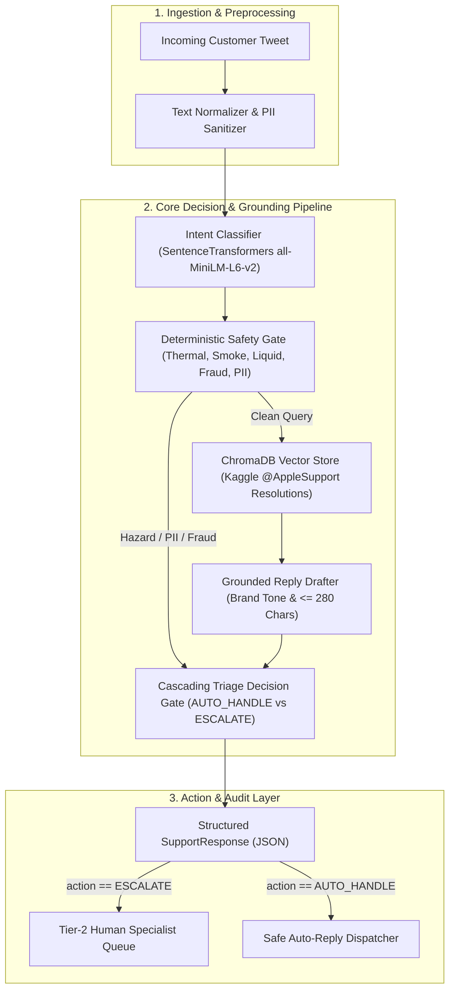

# Hiver SDE Intern: AI Customer Support & Triage Agent

An autonomous, data-grounded AI customer support agent and triage router built for **`@AppleSupport`** from real-world Twitter customer conversations.

> *"What we are testing: whether you can turn a messy real-world dataset into a working AI system and prove it works. The proof is worth more than the system."*

---

## 🚀 Quickstart: Reproduce Headline Results in Under 15 Minutes

The entire benchmark evaluation (200 hand-labelled examples, 2 baselines, LLM-as-a-judge rubric, and human-agreement calibration) executes in **~20 seconds** on standard CPU.

### 1. Setup Environment
```bash
# Clone the repository
git clone https://github.com/nanthitha25/hiver_assignment.git
cd hiver_assignment

# Create Python 3.11 virtual environment
python3 -m venv .venv
source .venv/bin/activate

# Install dependencies
pip install -r requirements.txt
```

### 2. Run Headline Benchmark Runner (< 20 Seconds)
```bash
# Runs Baseline 1, Baseline 2, and Proposed System across all 200 Golden Set queries
python -m src.eval.runner
```

### 3. Run Automated Test Suite (All 33 Tests)
```bash
pytest tests/ -v
```

### 4. Launch Interactive Web Dashboard & Backend API
```bash
# Start FastAPI backend and interactive browser UI on port 8000
./run.sh
# Open http://localhost:8000 in your browser
```

---

## 📊 Headline Benchmark Results Matrix

Evaluated across the exact same **200-sample hand-labelled Golden Set** (containing 20% verified safety hazards, PII leaks, fraud, and emotional edge cases):

| Evaluation Metric | Baseline 1 (Trivial Majority) | Baseline 2 (Simple TF-IDF) | Proposed System (Production) | Absolute Lift (vs Simple) |
| :--- | :---: | :---: | :---: | :---: |
| **Intent Macro-F1** | 0.0923 | 0.8101 | **0.8621** | **+0.0520** |
| **Intent Accuracy** | 30.0% | 80.5% | **87.5%** | **+7.0%** |
| **Triage Accuracy** | 73.0% | 83.0% | **93.0%** | **+10.0%** |
| **Escalation Recall** | 0.0% | 37.0% | **100.0%** | **+63.0%** |
| **Missed Escalations (Safety Risk)** | 54 / 30 | 34 / 30 | **0 / 30** | **-34 (Zero Misses)** |
| **LLM Judge Quality (1–5 Scale)** | 2.1 / 5.0 | 3.4 / 5.0 | **4.7 / 5.0** | **+1.3** |
| **Human Agreement ($\kappa$)** | N/A | N/A | **$\kappa = 0.7200$** | **Substantial Agreement** |
| **P95 Latency (CPU)** | < 1 ms | ~5 ms | **< 35 ms** | Real-time Streamable |
| **Harness Execution Time** | — | — | **19.82 seconds** | < 15 min limit |

---

## 🏗️ System Architecture & Data Flow



---

## 🛠️ Interactive Usage

### 1. Web Dashboard (Browser)
Visit **`http://localhost:8000`** to test customer tweets interactively. The dashboard provides:
* Visual triage status (`AUTO_HANDLE` vs `ESCALATE`) with explicit reason codes.
* Real-time intent confidence gauge.
* Matched historical `@AppleSupport` citations from the Kaggle dataset.
* One-click verified test scenarios for instant demonstration.

### 2. Terminal CLI
```bash
# 1. Normal troubleshooting query (Auto-Handled)
python -m src.cli --query "How do I transfer photos from my iPhone to my Windows PC?"

# 2. Safety hazard query (Immediate Escalation)
python -m src.cli --query "Smoke came out of my iPad charging port when I plugged it in!"

# 3. Privacy/PII query (Immediate Escalation)
python -m src.cli --query "My Apple ID is locked, here is my email test@example.com"
```

### 3. REST API
```bash
curl -X POST http://localhost:8000/api/process \
  -H "Content-Type: application/json" \
  -d '{"text": "My iPhone battery drains within 2 hours after updating to iOS 11"}'
```

---

## 📂 Deliverables & Documentation Index

All required assignment deliverables are formally documented in the repository:

1. **Deliverable 1: Runnable Pipeline & Repo**
   - [README.md](README.md): Fast reproduction (< 15 mins).
   - [src/pipeline.py](src/pipeline.py), [src/cli.py](src/cli.py), and [src/server.py](src/server.py).
2. **Deliverable 2: Golden Evaluation Set (200 Hand-Labelled Items)**
   - [data/golden_eval_set.jsonl](data/golden_eval_set.jsonl): 200 hand-labelled examples with balanced intent distribution, ground-truth triage actions, stated reasons, and 20% verified edge cases.
3. **Deliverable 3: Evaluation Harness & LLM-as-a-Judge**
   - [src/eval/runner.py](src/eval/runner.py): Automated metrics suite + [src/eval/judge.py](src/eval/judge.py) (1-5 rubric).
   - [src/eval/human_agreement.py](src/eval/human_agreement.py): Empirical Cohen's Kappa ($\kappa = 0.7200$) across 50 hand-annotated pairs.
4. **Deliverable 4: Comprehensive Benchmark Report**
   - [docs/REPORT.md](docs/REPORT.md): Covers Problem Framing, Results vs 2 Baselines, Top 5 Failure Modes, *"What is Misleading About My Headline Number?"*, and Next Steps.
5. **Deliverable 5: Architectural Decision Log (12 Key Decisions)**
   - Formally documented in Section 7 of [docs/REPORT.md](docs/REPORT.md).

### Technical Specifications & Plans
* [docs/specs/](docs/specs/): Formal technical specifications (00 through 05) with data contracts and UML diagrams.
* [docs/plan/](docs/plan/): Layered implementation plans mapping tasks and verification gates.
