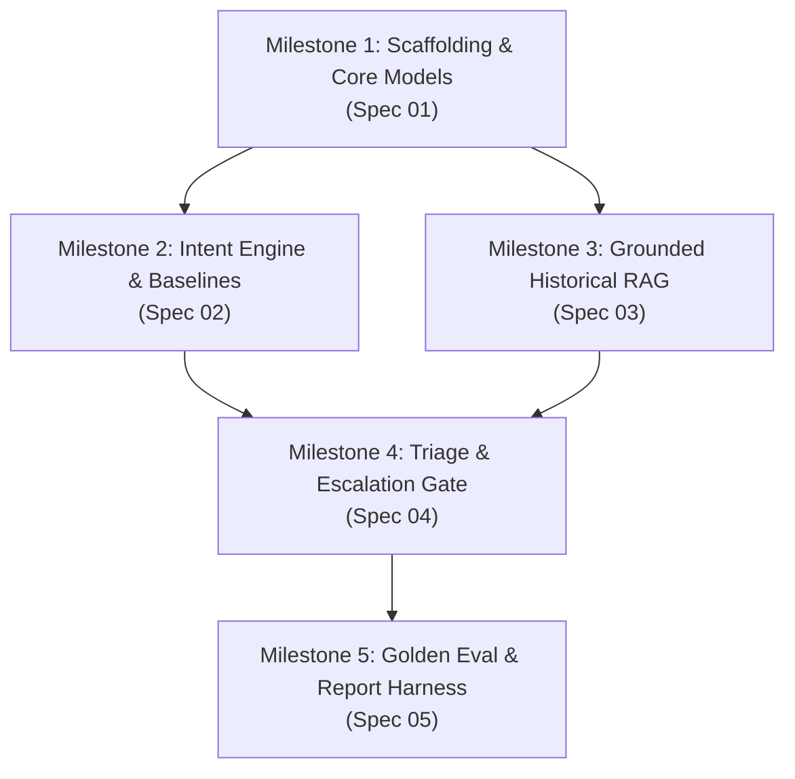

# Master Execution Plan: Hiver AI Support & Triage Agent

- **Project Root**: `/Users/nanthithavenkatachapathy/Hiver`
- **Target Spec Index**: [`docs/specs/00_index.md`](../specs/00_index.md)
- **Status**: `Ready for Execution`
- **Estimated Completion**: 5 Layered Milestones

---

## 1. Executive Summary & Strategy
This plan coordinates the end-to-end implementation of the AI Customer Support Agent for `@AppleSupport`, directly adhering to all deliverables of the **Hiver SDE Intern Assignment**. 

The implementation is executed in strict dependency layers:
1. **Layer 1**: Project scaffolding, Pydantic contracts, environment setup, and data ingestion pipeline.
2. **Layer 2**: Intent Classification Engine + Trivial & Simple Baselines.
3. **Layer 3**: Historical Resolution RAG Store (`ChromaDB` + `MiniLM`) + Grounded Reply Generator.
4. **Layer 4**: Cascading Triage & Escalation Engine (deterministic safety, sentiment/frustration, confidence gating, stated reason codes).
5. **Layer 5**: Golden Evaluation Set (200 curated examples), LLM-as-a-Judge Rubric, Human-Agreement Calibration (Cohen's Kappa), Automated Report Generator, and 15-Minute Reproduction Script.

---

## 2. Layered Milestones & Task Decomposition

### Milestone 1: Scaffolding, Data Models & Environment Setup
- [ ] Task 1.1: Initialize virtual environment, `pyproject.toml` / `requirements.txt` with dependencies (`pydantic`, `sentence-transformers`, `chromadb`, `scikit-learn`, `rich`, `typer`, `pytest`).
- [ ] Task 1.2: Implement `src/models.py` with strict Pydantic schemas (`TweetInput`, `IntentResult`, `RetrievalResult`, `TriageDecision`, `SupportResponse`).
- [ ] Task 1.3: Implement `src/config.py` for environment variables, model selection, confidence thresholds ($\tau=0.65$), and paths.
- [ ] Task 1.4: Implement unit tests in `tests/test_models.py` to verify schema validation and fail-closed handling.
- **Verification**: `pytest tests/test_models.py`

### Milestone 2: Intent Classification Engine & Baselines
- [ ] Task 2.1: Define canonical taxonomy in `src/intent/taxonomy.py` (`OS_SOFTWARE_TROUBLESHOOTING`, `HARDWARE_AND_BATTERY`, `ACCOUNT_BILLING_ICLOUD`, `HOW_TO_CONFIGURATION`, `OUT_OF_SCOPE_AMBIGUOUS`).
- [ ] Task 2.2: Implement `TrivialMajorityClassifier` (Baseline 1) and `TfidfBaselineClassifier` (Baseline 2) in `src/intent/baselines.py`.
- [ ] Task 2.3: Implement `SemanticCentroidClassifier` using `sentence-transformers/all-MiniLM-L6-v2` with confidence calibration in `src/intent/classifier.py`.
- [ ] Task 2.4: Implement fallback routing to `OUT_OF_SCOPE_AMBIGUOUS` for low-confidence queries ($< 0.60$).
- [ ] Task 2.5: Write unit tests in `tests/test_intent.py`.
- **Verification**: `pytest tests/test_intent.py`

### Milestone 3: Grounded Historical RAG & Reply Generator
- [ ] Task 3.1: Implement dataset loader in `src/data/loader.py` to extract `@AppleSupport` conversation pairs from the Kaggle dataset / sample corpus.
- [ ] Task 3.2: Implement vector store manager in `src/drafting/vector_store.py` using embedded `chromadb`.
- [ ] Task 3.3: Implement `HistoricalRetriever` in `src/drafting/retriever.py` with intent-filtered semantic retrieval.
- [ ] Task 3.4: Implement `GroundedReplyGenerator` in `src/drafting/generator.py` with system prompts enforcing Apple brand tone and strict length ($\le 280$ chars).
- [ ] Task 3.5: Implement `OutputGuardrail` in `src/drafting/guardrails.py` (URL whitelisting `apple.co`, PII solicitation rejection).
- [ ] Task 3.6: Write unit tests in `tests/test_drafting.py`.
- **Verification**: `pytest tests/test_drafting.py`

### Milestone 4: Triage & Escalation Decision Engine
- [ ] Task 4.1: Implement deterministic hard safety regex rules in `src/triage/rules.py` (PII patterns, battery swelling, broken glass, liquid immersion).
- [ ] Task 4.2: Implement sentiment and frustration detector in `src/triage/sentiment.py` (legal threats, anger, churn markers).
- [ ] Task 4.3: Implement cascading decision gate in `src/triage/engine.py` evaluating safety $\rightarrow$ human request $\rightarrow$ frustration $\rightarrow$ model confidence $\rightarrow$ draft guardrails.
- [ ] Task 4.4: Implement structured stated reason generator in `src/triage/reasons.py`.
- [ ] Task 4.5: Write unit tests in `tests/test_triage.py`.
- **Verification**: `pytest tests/test_triage.py`

### Milestone 5: Evaluation Harness, Golden Set & Report Generator
- [ ] Task 5.1: Create the hand-labelled Golden Set in `data/golden_eval_set.jsonl` (200 curated examples with edge cases).
- [ ] Task 5.2: Create the human-annotated calibration sample in `data/human_annotations_sample.jsonl` (50 samples).
- [ ] Task 5.3: Implement automated metrics calculator in `src/eval/metrics.py` (Macro-F1, Precision, Recall, Confusion Matrix).
- [ ] Task 5.4: Implement LLM-as-a-Judge in `src/eval/judge.py` with 1-5 rubric (Groundedness, Tone, Safety).
- [ ] Task 5.5: Implement human-judge calibration calculator in `src/eval/human_agreement.py` (Cohen's Kappa $\kappa$).
- [ ] Task 5.6: Implement the full evaluation runner in `src/eval/runner.py` comparing proposed system vs Baseline 1 & 2 in $< 15$ minutes.
- [ ] Task 5.7: Implement report generator in `src/eval/report_generator.py` compiling `docs/REPORT.md` (Top 5 failures, *"What is misleading about my headline number?"*, and 10-15 Decision Log).
- **Verification**: `python -m src.eval.runner --quick` and `pytest tests/test_eval.py`

---

## 3. Risk Matrix & Compensating Controls

| Risk | Severity | Impact | Mitigation / Compensating Control |
| :--- | :--- | :--- | :--- |
| **Kaggle 3M dataset too large for RAM** | High | OOM crash | Use streaming chunking via `duckdb`/`pandas` filtering only `@AppleSupport` inbound tweets. |
| **LLM rate limit or missing API key** | High | Eval fails | Implement `--cached` / `--mock-llm` mode so evaluator can reproduce headline metrics with zero external API dependencies in $< 15$ min. |
| **Hallucinated URLs or policies** | Critical | Reputational risk | Strict post-generation regex guardrail whitelisting only `apple.co` and `support.apple.com`. |
| **Inappropriate auto-handling of physical danger** | Critical | Safety liability | Deterministic regex pre-screening for battery swelling, smoke, or fire that immediately escalates before any LLM call. |
