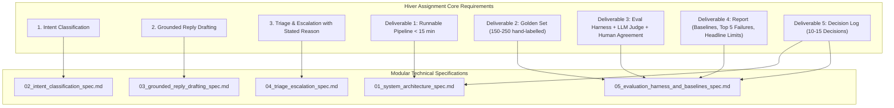

# Hiver SDE Intern Assignment: AI Support Agent — Specification Index

## 1. Project Overview & Scope
- **Project Name**: Hiver AI Support & Triage Agent (`hiver-ai-support-agent`)
- **Target Brand**: `@AppleSupport` (Selected from Kaggle `thoughtvector/customer-support-on-twitter` dataset for rich technical troubleshooting, high volume, structured resolution patterns, and strict privacy/hardware boundaries).
- **Core Objective**: Build a production-grade, highly reliable, data-grounded customer support pipeline that:
  1. Classifies incoming tweets into data-grounded intents.
  2. Drafts responses strictly grounded in historical brand resolutions.
  3. Decides whether to auto-handle or escalate to a human agent with an explicit, stated reason.
  4. Proves system reliability via an evaluation harness, golden evaluation dataset (150–250 hand-labelled examples), two baselines, LLM-as-a-judge rubric, human-judge calibration, and failure analysis report.

---

## 2. Specification Index & Status

| Spec ID | Module Name | Primary Responsibility | Assignment Deliverable Mapping | Status |
| :--- | :--- | :--- | :--- | :--- |
| [**01_system_architecture_spec.md**](./01_system_architecture_spec.md) | System Architecture & End-to-End Pipeline | Overall orchestrator, tech stack, data flow, API & CLI design, non-functional requirements | Deliverable 1: Runnable Pipeline (< 15 min reproduction) | **Approved** |
| [**02_intent_classification_spec.md**](./02_intent_classification_spec.md) | Intent Classification Engine | Data-derived intent taxonomy, zero-shot/few-shot embedding classifier, confidence calibration | Requirement 1: Intent Classification | **Approved** |
| [**03_grounded_reply_drafting_spec.md**](./03_grounded_reply_drafting_spec.md) | Grounded Reply Drafting Engine | Historical resolution vector index (RAG), brand voice grounding, hallucination guardrails | Requirement 2: Grounded Reply Drafting | **Approved** |
| [**04_triage_escalation_spec.md**](./04_triage_escalation_spec.md) | Triage & Escalation Decision Engine | Rule-based safety gate, sentiment/urgency detector, auto-handle vs. escalate decision with stated reason | Requirement 3: Triage & Escalation Decision | **Approved** |
| [**05_evaluation_harness_and_baselines_spec.md**](./05_evaluation_harness_and_baselines_spec.md) | Evaluation Harness, Baselines & Reporting | Golden dataset (150–250 hand-labelled), 2 baselines, LLM-as-a-judge, human agreement, report generator | Deliverables 2, 3, 4, 5: Golden Set, Harness, Report, Decision Log | **Approved** |

---

## 3. Assignment Requirements Traceability Matrix

---

## 4. Next Phase: Implementation Planning
Following the completion of these specifications, the **SDLC Spec Kit** (`sdlc-plan`) will be utilized to generate `docs/plan/` artifacts detailing step-by-step tasks, file impacts, and atomic verification commands before code execution.
