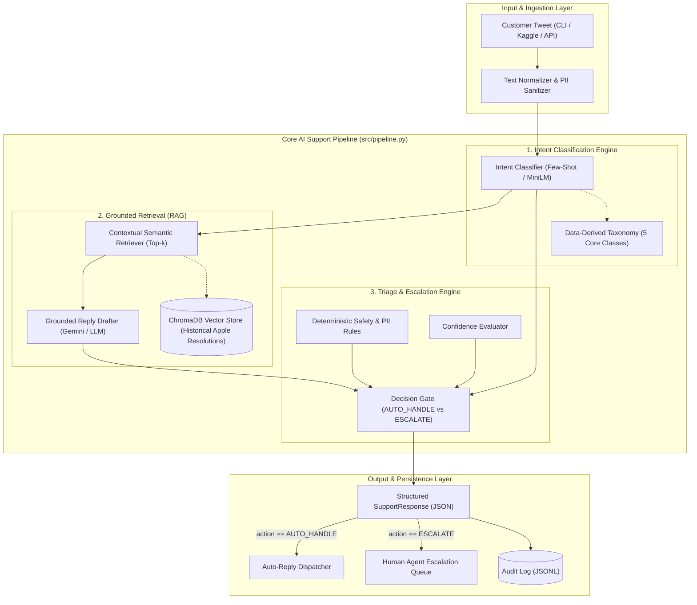
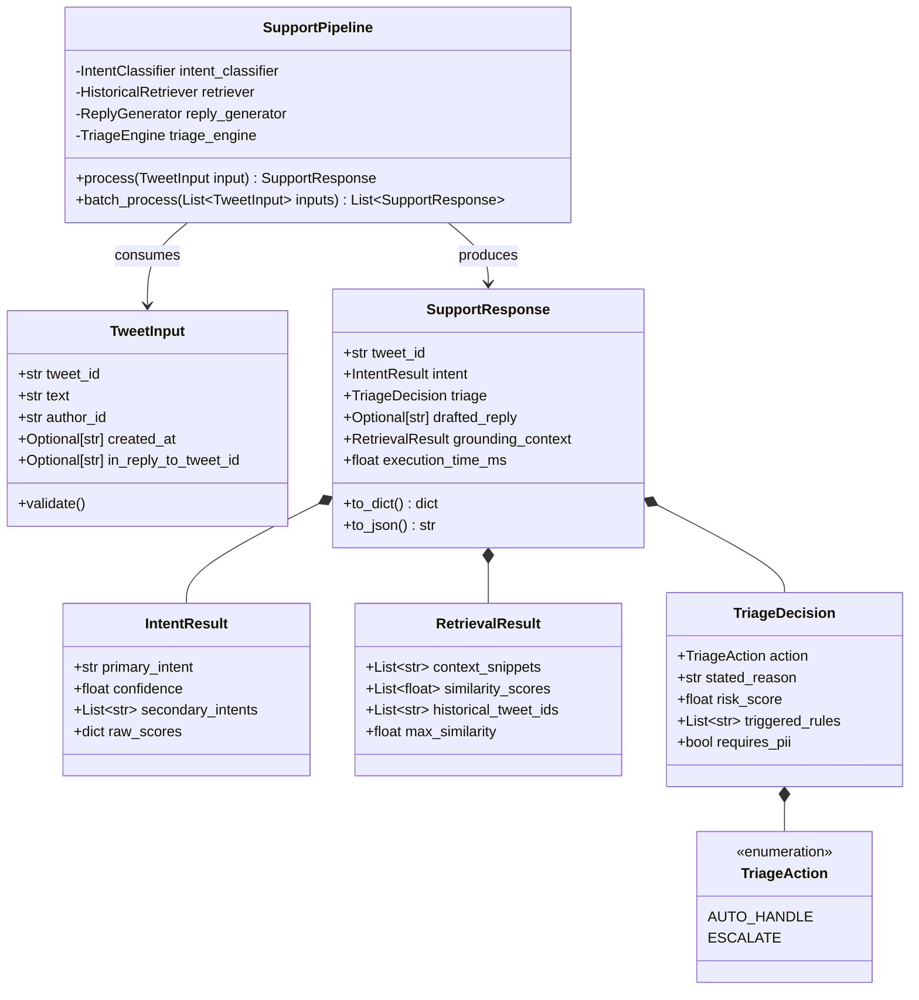
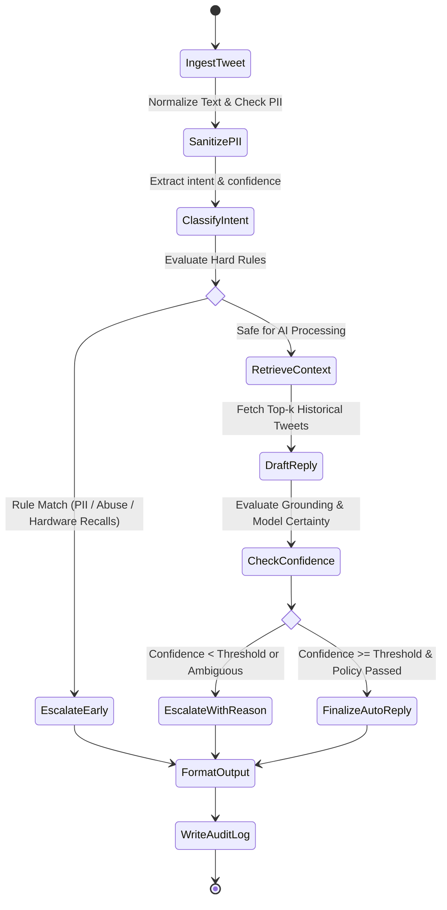
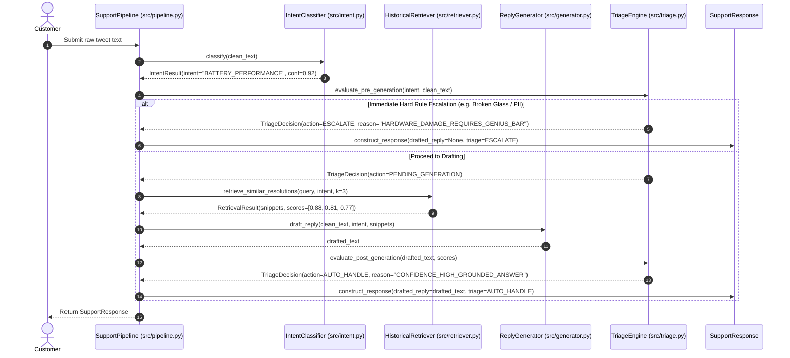

# Specification 01: System Architecture & Pipeline Orchestration

- **Module Name**: `system_architecture`
- **Target Version**: `1.0.0`
- **Status**: `Approved`
- **Target Source Files**:
  - `src/pipeline.py`
  - `src/config.py`
  - `src/models.py`
  - `src/cli.py`

---

## 1. Problem Statement & Scope Boundaries

### 1.1 Problem Statement
Customer support on public social media (Twitter/X) is noisy, high-volume, multi-turn, and fraught with reputational risk. A real-world AI customer support agent must handle incoming queries with extreme reliability: correctly routing issues, drafting polite and historically grounded responses, and safely escalating ambiguous, frustrated, or high-risk cases to human agents.

For **`@AppleSupport`**, customer queries range from trivial questions ("How do I restart my iPhone?") to complex OS bugs, hardware battery recalls, stolen devices, and sensitive Apple ID account lockouts. A generic LLM risks hallucinating unsupported warranty policies, attempting to collect private credentials in public, or providing harmful advice. 

The **System Architecture** orchestrates an end-to-end processing pipeline that consumes raw customer tweets, executes intent classification, retrieves historically grounded brand resolutions, applies a strict triage/escalation policy gate, and outputs a structured decision payload.

### 1.2 What "Good" Means for @AppleSupport
1. **Safety & Privacy First**: Zero tolerance for requesting Apple ID passwords, credit card info, or sensitive credentials publicly. Immediate escalation or deflection to Apple's official secure support link (`apple.co/...`) or DM.
2. **Empathetic & Polished Tone**: Adherence to Apple Support's signature conversational style ("We'd be glad to help," acknowledging OS version, concise diagnostic questions).
3. **High Groundedness**: Every proposed recommendation must reflect actual procedures historically documented in the Twitter support dataset or Apple Support Knowledge Base.
4. **Transparent Explainability**: Auto-handling vs. escalation decisions must have unambiguous, audit-ready reasoning.

### 1.3 What We Chose NOT to Build (Explicit Scope Boundaries)
1. **No Direct Twitter Write Access / Live Bot Tweeting**: We do not deploy a live automated bot that posts directly to public Twitter. It operates as an internal copilot/triage pipeline for support agents.
2. **No Backend Apple Internal DB Integration**: We do not simulate or mock real iCloud database modifications or device unlocks. Hardware repairs and warranty checks are deflected to official Genius Bar appointment flows.
3. **No Multi-Language Translation in v1**: The scope is strictly bounded to English tweets within the `@AppleSupport` dataset.

---

## 2. Tech Stack & Dependencies

| Component | Technology | Rationale |
| :--- | :--- | :--- |
| **Runtime & Language** | Python 3.11+ | Industry standard for modern LLM applications, typing support, async I/O. |
| **Data Models & Validation** | `pydantic` v2.x | High-performance schema validation, JSON serialization, strict type contracts. |
| **Vector Storage (RAG)** | `chromadb` (Embedded SQLite) | Zero external daemon dependency, runs in-process, instant setup, reproducible in < 15 min. |
| **Embeddings** | `sentence-transformers` (`all-MiniLM-L6-v2`) | Local, fast, deterministic, zero API cost, runs on CPU/M-series Mac. |
| **LLM Inference** | Dual-Provider Strategy: Google Gemini API (`gemini-2.5-flash`) / Local Fallback | High reasoning capability, low latency, structured JSON mode. |
| **Data Processing** | `pandas` & `duckdb` | Fast querying of the 3M Kaggle Twitter dataset without blowing up RAM. |
| **CLI & Harness** | `typer` & `rich` | Beautiful terminal output, progress bars, automated benchmarking in a single command. |
| **Testing** | `pytest`, `pytest-cov`, `pytest-mock` | Automated test suite and regression harness. |

---

## 3. Functional & Non-Functional Requirements

### 3.1 Functional Requirements (FR)
- **FR-01 (End-to-End Ingestion)**: Pipeline must accept an incoming raw tweet JSON payload containing `tweet_id`, `text`, `author_id`, and optional `in_reply_to_tweet_id`.
- **FR-02 (Pipeline Orchestration)**: System must execute the workflow in sequential order: Ingestion -> Preprocessing -> Intent Classification -> Historical Retrieval -> Triage Decision -> Grounded Reply Drafting -> Output Structuring.
- **FR-03 (Dual-Mode Execution)**: Pipeline must support both batch processing (for evaluation of 150–250 golden items) and single-query interactive CLI mode.
- **FR-04 (Fallback & Circuit Breaking)**: If LLM API fails or times out, the pipeline must fail-closed to `ESCALATE` with reason `"LLM_UPSTREAM_TIMEOUT"`.

### 3.2 Non-Functional Requirements (NFR)
- **NFR-01 (Latency)**: Single tweet processing latency must be $\le 1.8$ seconds on CPU + Cloud LLM, and $\le 250$ ms on pure retrieval + local heuristic.
- **NFR-02 (Reproducibility)**: The entire evaluation harness and headline result generation must execute in **under 15 minutes** from cold start on a standard developer machine.
- **NFR-03 (Determinism & Auditability)**: All decisions must be saved to a structured JSONL audit trail with timestamps, intent scores, retrieval similarity scores, and escalation flags.
- **NFR-04 (Zero PII Leakage)**: Customer handles, emails, and phone numbers must be sanitized/masked before logging.

---

## 4. Architecture & Design Diagrams

### 4.1 Architecture Diagram


### 4.2 Class Diagram


### 4.3 Use Case Diagram
```mermaid
graph LR
    actor Customer as "Customer (Twitter User)"
    actor HumanAgent as "Tier-2 Human Support Agent"
    actor Evaluator as "Hiver Evaluator / SDE"

    subgraph System["Hiver AI Support Agent System"]
        UC1["Submit Support Inquiry"]
        UC2["Classify Intent"]
        UC3["Retrieve Historical Resolutions"]
        UC4["Draft Grounded Reply"]
        UC5["Decide Auto-Handle vs Escalate"]
        UC6["Review Escalated Ticket with Stated Reason"]
        UC7["Execute 15-Minute Evaluation Harness"]
        UC8["Inspect Failure Modes & Benchmark Report"]
    end

    Customer --> UC1
    UC1 --> UC2
    UC2 --> UC3
    UC3 --> UC4
    UC4 --> UC5
    UC5 -->|Escalated| UC6
    HumanAgent --> UC6
    Evaluator --> UC7
    Evaluator --> UC8
```

### 4.4 Activity Diagram


### 4.5 Sequence Diagram


---

## 5. Data Schemas & API Contracts

### 5.1 Input Schema (`TweetInput`)
```json
{
  "$schema": "http://json-schema.org/draft-07/schema#",
  "title": "TweetInput",
  "type": "object",
  "properties": {
    "tweet_id": { "type": "string" },
    "text": { "type": "string", "minLength": 1, "maxLength": 1000 },
    "author_id": { "type": "string" },
    "created_at": { "type": "string" },
    "in_reply_to_tweet_id": { "type": ["string", "null"] }
  },
  "required": ["tweet_id", "text", "author_id"]
}
```

### 5.2 Output Schema (`SupportResponse`)
```json
{
  "$schema": "http://json-schema.org/draft-07/schema#",
  "title": "SupportResponse",
  "type": "object",
  "properties": {
    "tweet_id": { "type": "string" },
    "intent": {
      "type": "object",
      "properties": {
        "primary_intent": { "type": "string" },
        "confidence": { "type": "number", "minimum": 0.0, "maximum": 1.0 },
        "secondary_intents": { "type": "array", "items": { "type": "string" } }
      },
      "required": ["primary_intent", "confidence"]
    },
    "triage": {
      "type": "object",
      "properties": {
        "action": { "type": "string", "enum": ["AUTO_HANDLE", "ESCALATE"] },
        "stated_reason": { "type": "string" },
        "risk_score": { "type": "number" },
        "triggered_rules": { "type": "array", "items": { "type": "string" } }
      },
      "required": ["action", "stated_reason"]
    },
    "drafted_reply": { "type": ["string", "null"] },
    "grounding_context": {
      "type": "object",
      "properties": {
        "snippets": { "type": "array", "items": { "type": "string" } },
        "max_similarity": { "type": "number" }
      }
    },
    "execution_time_ms": { "type": "number" }
  },
  "required": ["tweet_id", "intent", "triage", "execution_time_ms"]
}
```

---

## 6. Definition of Done & Executable Test Cases

| Test ID | Target Component | Command / Verification Action | Expected Outcome |
| :--- | :--- | :--- | :--- |
| **TC-ARCH-01** | Data Models | `pytest tests/test_models.py` | All Pydantic models validate valid JSON and reject malformed schemas. |
| **TC-ARCH-02** | Pipeline Integration | `pytest tests/test_pipeline.py::test_end_to_end_single_tweet` | Single tweet runs through all 3 stages in $< 2.0$s and outputs valid `SupportResponse`. |
| **TC-ARCH-03** | Fail-Closed Timeout | `pytest tests/test_pipeline.py::test_upstream_timeout_escalates` | LLM mock timeout results in `action="ESCALATE"` with `stated_reason="LLM_UPSTREAM_TIMEOUT"`. |
| **TC-ARCH-04** | CLI Harness | `python -m src.cli process --text "My iPhone 11 battery drains in 2 hours"` | Prints formatted Rich card with classified intent, grounded reply, and triage decision. |
