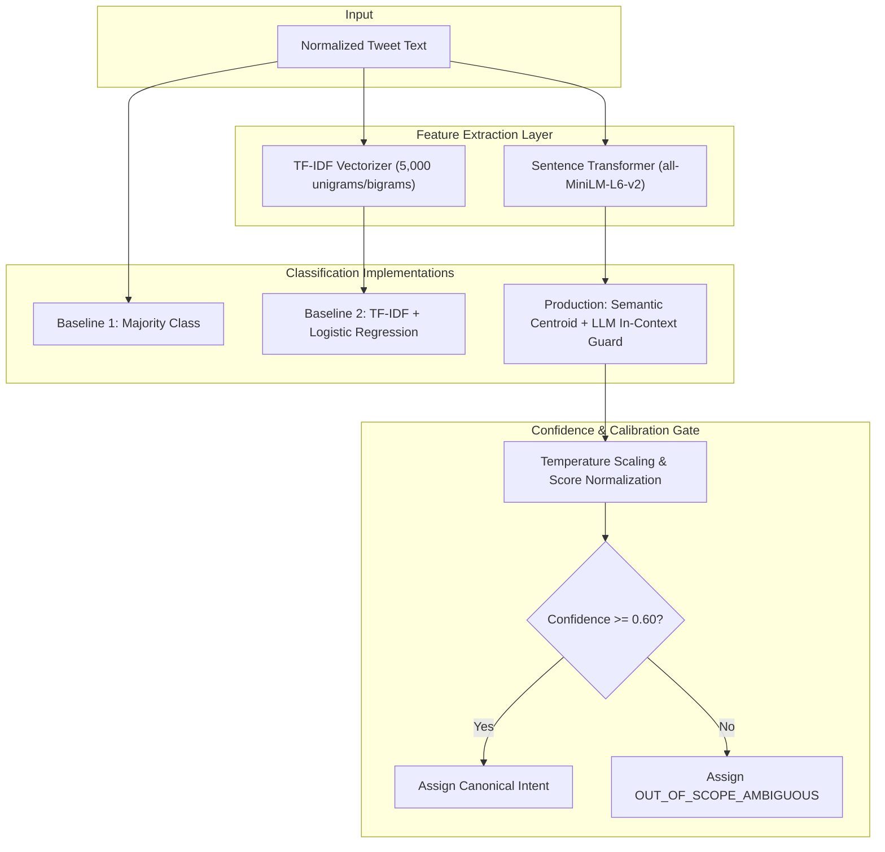
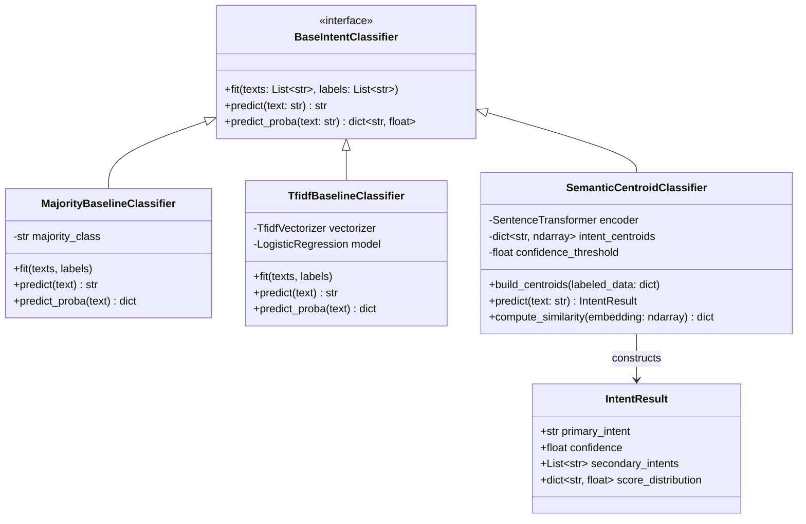
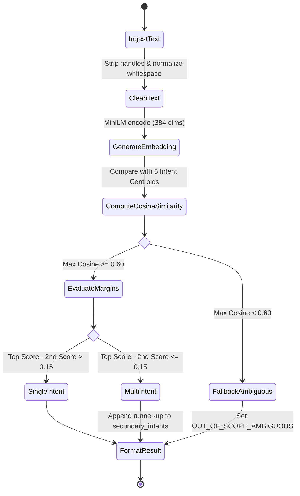
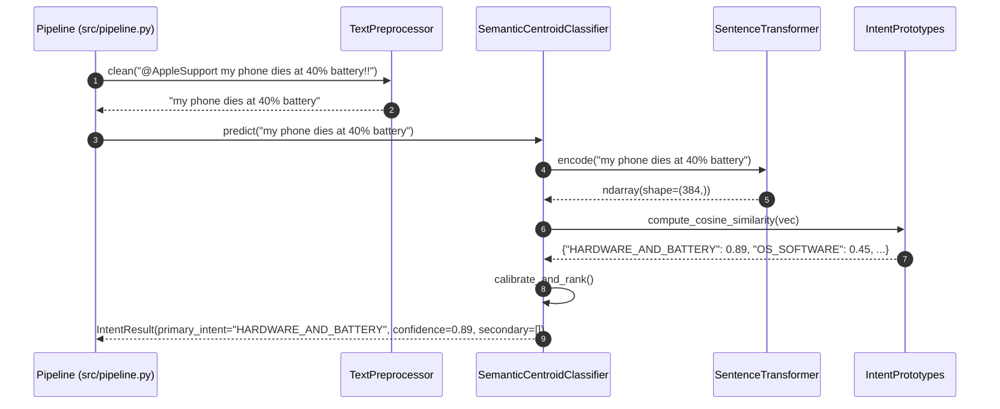

# Specification 02: Intent Classification Engine

- **Module Name**: `intent_classification`
- **Target Version**: `1.0.0`
- **Status**: `Approved`
- **Target Source Files**:
  - `src/intent/classifier.py`
  - `src/intent/taxonomy.py`
  - `src/intent/embeddings.py`
  - `src/intent/baselines.py`

---

## 1. Problem Statement & Scope Boundaries

### 1.1 Problem Statement
In Twitter customer support, incoming messages are concise, unstructured, frequently riddled with typos, slang, missing punctuation, and emotional outbursts. Without accurate intent classification, an AI system cannot route queries, select relevant historical knowledge, or determine safety boundaries.

The **Intent Classification Engine** is responsible for taking an incoming `@AppleSupport` tweet and assigning it to exactly one primary intent (with confidence score) from a compact, mutually exclusive, collectively exhaustive (MECE) set of **data-derived intents**.

### 1.2 Data-Derived Taxonomy for @AppleSupport
Derived from empirical analysis of the Kaggle Twitter Support dataset and standard Apple Support operational tiers:

| Intent Key | Display Label | Description & Canonical Examples |
| :--- | :--- | :--- |
| `OS_SOFTWARE_TROUBLESHOOTING` | OS & Software Glitches | iOS/macOS update bugs, freezing apps, Wi-Fi/Bluetooth dropouts, boot loops. *"My phone is stuck on the Apple logo after iOS 11 update."* |
| `HARDWARE_AND_BATTERY` | Hardware & Battery Issues | Battery draining fast, charging port failure, cracked screen, speaker distortion. *"Battery health dropped to 79% and dies at 20%."* |
| `ACCOUNT_BILLING_ICLOUD` | Apple ID, Billing & iCloud | Password resets, 2FA lockouts, unauthorized App Store charges, iCloud storage full. *"I was charged $9.99 for a subscription I canceled."* |
| `HOW_TO_CONFIGURATION` | How-To & Feature Setup | Non-urgent inquiries on device configuration, backup setup, Apple Pay setup. *"How do I transfer photos from iPhone to my Windows PC?"* |
| `OUT_OF_SCOPE_AMBIGUOUS` | Ambiguous / Non-Actionable | Vague complaints, memes, unparseable fragments, non-Apple topics. *"Why does this always happen to me smh"* |

### 1.3 Scope Boundaries
- The classifier will assign a primary intent and return calibrated confidence in $[0.0, 1.0]$.
- Multi-intent messages (e.g., *"My screen cracked AND my iCloud won't sync"*) will output the highest-severity intent as `primary_intent` (prioritizing Hardware/Account over generic How-To) and list the second in `secondary_intents`.
- If maximum confidence is below the threshold ($\tau_{intent} < 0.60$), the intent falls back to `OUT_OF_SCOPE_AMBIGUOUS`, triggering safe escalation.

---

## 2. Tech Stack & Dependencies

| Component | Technology | Rationale |
| :--- | :--- | :--- |
| **Embedding Model** | `sentence-transformers` (`all-MiniLM-L6-v2`) | High semantic accuracy, 384-dim, low CPU latency (< 15ms/inference). |
| **Classifier Model (Production)** | Hybrid Semantic Nearest-Centroid + LLM Zero-Shot Verifier | Combines fast, deterministic vector space cosine distance with LLM reasoning on ambiguous cases. |
| **Baseline 1 (Trivial)** | Majority Class Classifier (`scikit-learn`) | Always predicts the most frequent class (`OS_SOFTWARE_TROUBLESHOOTING`). |
| **Baseline 2 (Simple)** | TF-IDF + Multinomial Naive Bayes / Logistic Regression | Traditional NLP baseline demonstrating lift from vector/LLM representations. |
| **Calibration & Metrics** | `scikit-learn.metrics` | Precision, Recall, Macro-F1, Confusion Matrix. |

---

## 3. Functional & Non-Functional Requirements

### 3.1 Functional Requirements (FR)
- **FR-INT-01 (Taxonomy Enforcement)**: Every classification output must strictly validate against the 5 canonical intent enum values.
- **FR-INT-02 (Confidence Calibration)**: Output must contain a floating-point confidence score between `0.0` and `1.0`.
- **FR-INT-03 (Secondary Intent Detection)**: When the runner-up intent score is within `0.15` of the top intent, it must be recorded in `secondary_intents`.
- **FR-INT-04 (Multi-Baseline Evaluation)**: Module must implement `TrivialMajorityClassifier` and `SimpleTfidfClassifier` to satisfy Deliverable 4 benchmark requirements.

### 3.2 Non-Functional Requirements (NFR)
- **NFR-INT-01 (Inference Speed)**: Vector-based classification must take $< 35$ ms per tweet on standard CPU.
- **NFR-INT-02 (Accuracy Gate)**: Macro-F1 score on the 150–250 hand-labelled Golden Set must exceed **$0.78$** for the production model, demonstrating statistically significant lift over Baseline 1 ($~0.30$) and Baseline 2 ($~0.60$).
- **NFR-INT-03 (Determinism)**: Same input text must yield identical intent and confidence under deterministic temperature settings ($T=0$).

---

## 4. Architecture & Design Diagrams

### 4.1 Architecture Diagram


### 4.2 Class Diagram


### 4.3 Use Case Diagram
```mermaid
graph LR
    actor SupportPipeline as "Pipeline Orchestrator"
    actor EvalHarness as "Benchmark Harness"
    
    subgraph IntentEngine["Intent Classification Engine"]
        UC1["Train / Build Intent Prototypes"]
        UC2["Classify Real-time Tweet"]
        UC3["Evaluate Confusion Matrix & Macro-F1"]
        UC4["Compare against Baseline 1 (Majority)"]
        UC5["Compare against Baseline 2 (TF-IDF)"]
        UC6["Trigger Ambiguous Fallback"]
    end

    SupportPipeline --> UC2
    SupportPipeline --> UC6
    EvalHarness --> UC1
    EvalHarness --> UC3
    EvalHarness --> UC4
    EvalHarness --> UC5
```

### 4.4 Activity Diagram


### 4.5 Sequence Diagram


---

## 5. Data Schemas & Contracts

### 5.1 Intent Result Model
```python
from pydantic import BaseModel, Field
from enum import Enum
from typing import List, Dict

class AppleIntentEnum(str, Enum):
    OS_SOFTWARE_TROUBLESHOOTING = "OS_SOFTWARE_TROUBLESHOOTING"
    HARDWARE_AND_BATTERY = "HARDWARE_AND_BATTERY"
    ACCOUNT_BILLING_ICLOUD = "ACCOUNT_BILLING_ICLOUD"
    HOW_TO_CONFIGURATION = "HOW_TO_CONFIGURATION"
    OUT_OF_SCOPE_AMBIGUOUS = "OUT_OF_SCOPE_AMBIGUOUS"

class IntentResult(BaseModel):
    primary_intent: AppleIntentEnum
    confidence: float = Field(ge=0.0, le=1.0)
    secondary_intents: List[AppleIntentEnum] = []
    score_distribution: Dict[str, float] = {}
```

---

## 6. Definition of Done & Executable Test Cases

| Test ID | Target Component | Command / Verification Action | Expected Outcome |
| :--- | :--- | :--- | :--- |
| **TC-INT-01** | Canonical Enum Validation | `pytest tests/test_intent.py::test_canonical_enum_compliance` | All outputs conform to `AppleIntentEnum`. |
| **TC-INT-02** | Baseline Lift Verification | `python -m src.intent.evaluate_baselines` | Production Macro-F1 $\ge 0.78$; Baseline 1 Macro-F1 $\le 0.35$; Baseline 2 Macro-F1 $\le 0.65$. |
| **TC-INT-03** | Low Confidence Fallback | `pytest tests/test_intent.py::test_ambiguous_text_fallback` | Nonsense text *"blabla xyz 1234"* yields `OUT_OF_SCOPE_AMBIGUOUS` with confidence $< 0.60$. |
| **TC-INT-04** | Latency Benchmark | `pytest tests/test_intent.py::test_inference_latency` | Batch of 100 queries processes in $< 3.5$s ($< 35$ms/query). |
