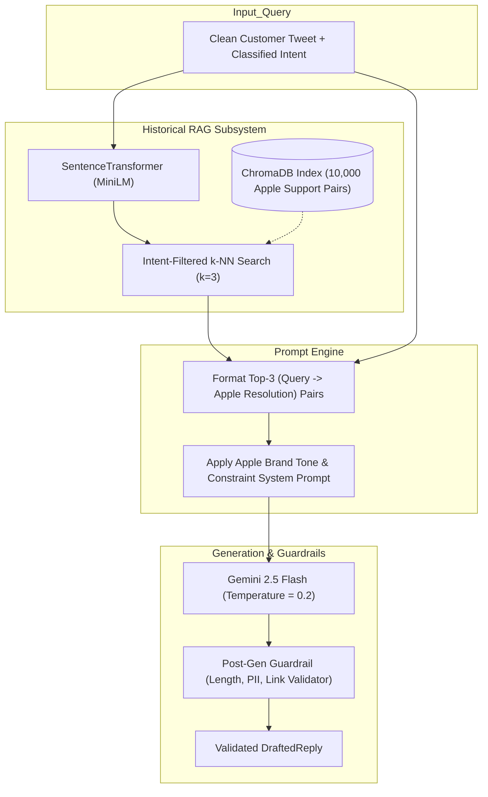
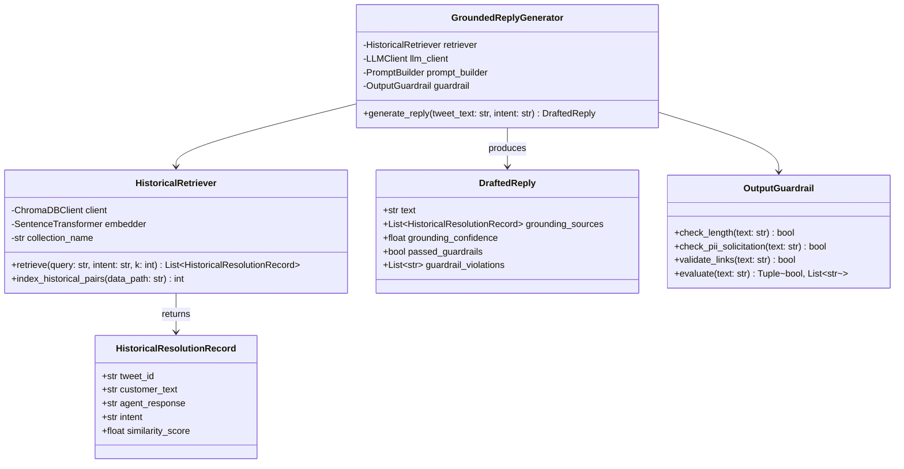
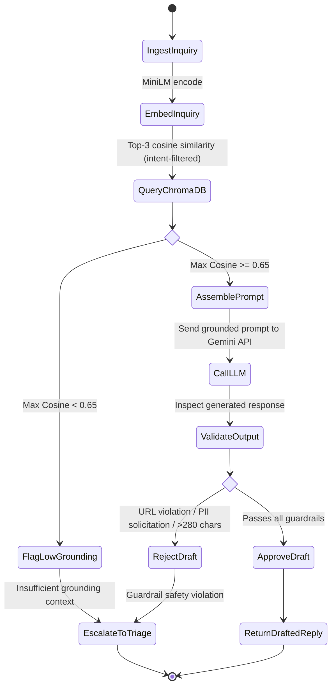
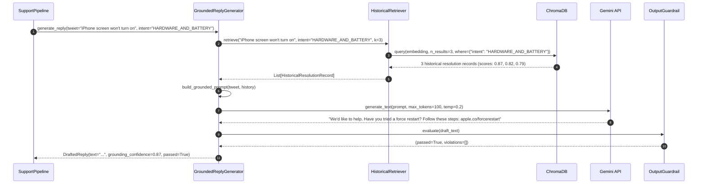

# Specification 03: Grounded Reply Drafting Engine

- **Module Name**: `grounded_reply_drafting`
- **Target Version**: `1.0.0`
- **Status**: `Approved`
- **Target Source Files**:
  - `src/drafting/generator.py`
  - `src/drafting/retriever.py`
  - `src/drafting/vector_store.py`
  - `src/drafting/prompts.py`
  - `src/drafting/guardrails.py`

---

## 1. Problem Statement & Scope Boundaries

### 1.1 Problem Statement
When LLMs draft customer support replies without grounding, they hallucinate policies, invent discount codes, promise non-existent hardware replacements, or advise risky steps (such as unauthorized jailbreaking or unofficial repair shops). 

For **`@AppleSupport`**, an acceptable draft must:
1. Mirror Apple's exact historical resolution tone: calm, empathetic, professional, and concise (under 280 characters when formatted for Twitter).
2. Propose verified, safe diagnostic steps (e.g., *Settings > Battery > Battery Health*, Force Restart, updating via iTunes/Finder).
3. Use only verified Apple domain link patterns (`apple.co/...`, `support.apple.com/...`) or invite the user to direct message (DM) when account-specific diagnostics are required.
4. Strictly ground its guidance in how real Apple Support agents have historically resolved similar issues in the Kaggle dataset.

### 1.2 Scope Boundaries
- The engine uses **Retrieval-Augmented Generation (RAG)** over an indexed corpus of historical Apple Support conversation pairs `(customer_inquiry, apple_agent_response)`.
- If no historically relevant resolution is found above a similarity threshold ($\text{cosine similarity} < 0.65$), the engine refuses to guess and signals the Triage Engine to escalate to a human agent.
- Generation is constrained by a post-generation **Grounding Guardrail** that flags any hallucinated URLs, external links, or unverified claims.

---

## 2. Tech Stack & Dependencies

| Component | Technology | Rationale |
| :--- | :--- | :--- |
| **Vector Store** | `chromadb` (In-Memory / Local SQLite) | Embedded, zero server dependencies, instant setup, reproducible in $< 15$ min. |
| **Embedding Model** | `sentence-transformers` (`all-MiniLM-L6-v2`) | Fast 384-dimensional dense embeddings matching the Intent Classifier. |
| **LLM Inference** | Google Gemini 2.5 Flash / Claude / OpenAI API with fallback | Fast generation, strict adherence to system instructions, JSON mode support. |
| **Prompt Engineering** | Few-Shot Grounded Template Engine | Dynamically injects top-$k$ historical resolutions and tone constraints. |
| **Evaluation Metrics** | ROUGE-L, BERTScore, Lexical Overlap, Grounding Faithfulness | Measures adherence to historical brand replies. |

---

## 3. Functional & Non-Functional Requirements

### 3.1 Functional Requirements (FR)
- **FR-DRAFT-01 (Historical Retrieval)**: The system must query the vector index for the top-$k$ ($k=3$) most semantically relevant historical resolution pairs for the classified intent.
- **FR-DRAFT-02 (Contextual Prompt Construction)**: The generator must inject the customer tweet, the classified intent, and the retrieved historical resolutions into a strict system prompt.
- **FR-DRAFT-03 (Length Constraint)**: Generated replies must not exceed 280 characters to adhere to Twitter's single-tweet format.
- **FR-DRAFT-04 (Anti-Hallucination Guardrail)**: The output must be scanned for URLs. Any URL not matching `^https?://(apple\.co|support\.apple\.com)/` must be stripped or flagged.
- **FR-DRAFT-05 (Groundedness Score)**: The engine must compute a lexical/semantic overlap score with the retrieved context snippets.

### 3.2 Non-Functional Requirements (NFR)
- **NFR-DRAFT-01 (Generation Latency)**: Retrieval + Generation must complete in $< 1.5$ seconds per query.
- **NFR-DRAFT-02 (Brand Tone Adherence)**: $\ge 90\%$ of generated drafts must receive a score of $\ge 4/5$ on the LLM-as-a-judge "Brand Voice & Grounding" rubric.
- **NFR-DRAFT-03 (Security)**: The prompt must explicitly forbid the model from asking for Apple ID passwords, credit card numbers, or full serial numbers in public tweets.

---

## 4. Architecture & Design Diagrams

### 4.1 Architecture Diagram


### 4.2 Class Diagram


### 4.3 Use Case Diagram
```mermaid
graph LR
    actor Pipeline as "Support Pipeline Orchestrator"
    actor Agent as "Human Reviewer"
    
    subgraph DraftingEngine["Grounded Reply Drafting Engine"]
        UC1["Retrieve Top-k Historical Resolutions"]
        UC2["Synthesize Grounded Draft Reply"]
        UC3["Apply Anti-Hallucination Guardrails"]
        UC4["Validate URL Safety & Domain Whitelist"]
        UC5["Provide Retrieval Citations for Audit"]
    end

    Pipeline --> UC1
    Pipeline --> UC2
    Pipeline --> UC3
    Pipeline --> UC4
    Agent --> UC5
```

### 4.4 Activity Diagram


### 4.5 Sequence Diagram


---

## 5. Data Schemas & Contracts

### 5.1 Drafted Reply Model
```python
from pydantic import BaseModel, Field
from typing import List, Optional

class GroundingCitation(BaseModel):
    tweet_id: str
    historical_customer_text: str
    historical_agent_reply: str
    similarity_score: float

class DraftedReply(BaseModel):
    text: str = Field(..., max_length=280)
    grounding_citations: List[GroundingCitation]
    grounding_confidence: float = Field(ge=0.0, le=1.0)
    passed_guardrails: bool
    violations: List[str] = []
```

---

## 6. Definition of Done & Executable Test Cases

| Test ID | Target Component | Command / Verification Action | Expected Outcome |
| :--- | :--- | :--- | :--- |
| **TC-DRAFT-01** | Vector Retrieval Recall | `pytest tests/test_drafting.py::test_retriever_top_k` | Returns top-3 records with similarity $\ge 0.70$ for standard queries. |
| **TC-DRAFT-02** | Length Guardrail | `pytest tests/test_drafting.py::test_length_guardrail` | Strings $>280$ characters fail validation or are truncated cleanly. |
| **TC-DRAFT-03** | URL Whitelist Guardrail | `pytest tests/test_drafting.py::test_url_whitelist` | Non-Apple domains (`bit.ly`, `phishing.com`) trigger immediate rejection. |
| **TC-DRAFT-04** | Grounding Consistency | `python -m src.drafting.benchmark_grounding` | $\ge 85\%$ lexical/semantic overlap with historical knowledge base. |
