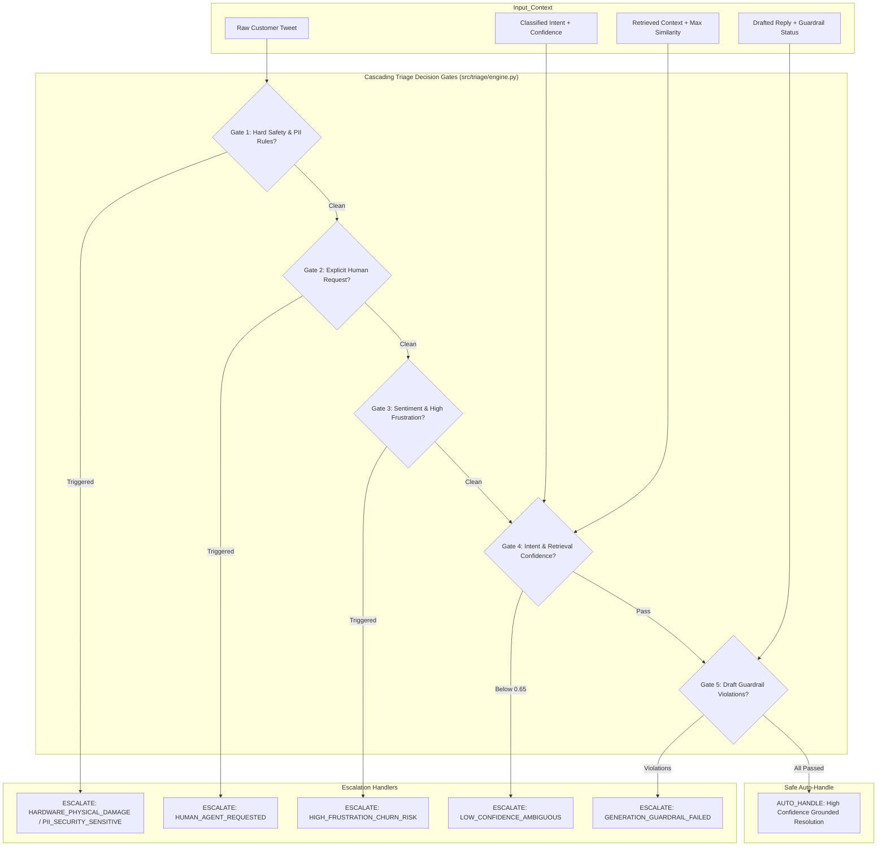
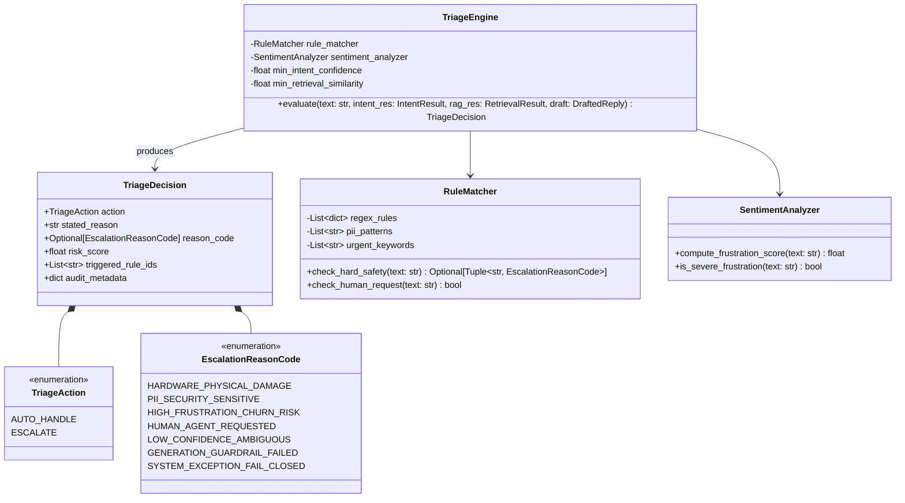
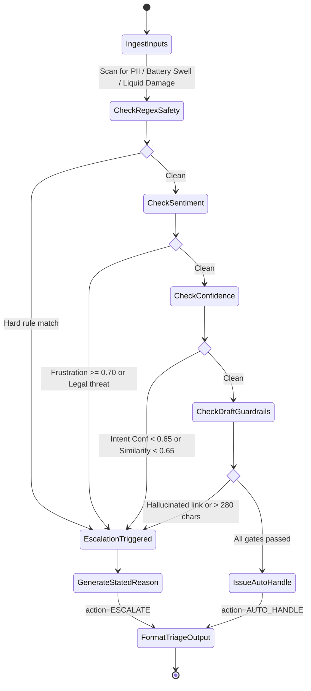
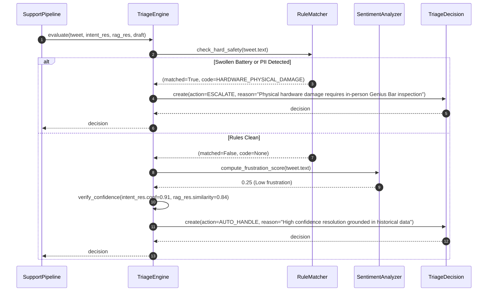

# Specification 04: Triage & Escalation Decision Engine

- **Module Name**: `triage_escalation`
- **Target Version**: `1.0.0`
- **Status**: `Approved`
- **Target Source Files**:
  - `src/triage/engine.py`
  - `src/triage/rules.py`
  - `src/triage/sentiment.py`
  - `src/triage/reasons.py`

---

## 1. Problem Statement & Scope Boundaries

### 1.1 Problem Statement
The most perilous failure mode of an autonomous customer support agent is inappropriate auto-handling: sending canned responses to outraged customers, mishandling financial fraud or stolen hardware, attempting to troubleshoot physically dangerous situations (such as a swelling battery), or requesting confidential PII on a public Twitter thread.

To earn trust, the AI system must make **defensible, deterministic, and explainable triage decisions**:
1. Categorically distinguish between routine informational queries that can safely be **`AUTO_HANDLE`**d vs. sensitive, complex, or high-risk issues that must be **`ESCALATE`**d to a human Tier-2 specialist.
2. Supply a clear, audit-ready **stated reason** for every escalation decision.
3. Implement a **fail-closed** architecture: when in doubt, escalate.

### 1.2 Escalation Taxonomy & Stated Reasons

| Category | Escalation Reason Code | Trigger Conditions | Example Tweet |
| :--- | :--- | :--- | :--- |
| **Safety & Physical** | `HARDWARE_PHYSICAL_DAMAGE` | Cracked glass, liquid immersion, burning/swollen battery, smoke. | *"My iPhone battery expanded and pushed the screen off!"* |
| **Security & PII** | `PII_SECURITY_SENSITIVE` | User includes email, phone, credit card, or Apple ID lockout with 2FA block. | *"My account is locked, here is my email test@domain.com"* |
| **Customer Frustration** | `HIGH_FRUSTRATION_CHURN_RISK` | Severe negative sentiment, explicit threats ("lawsuit", "attorney", "switching to Android"). | *"3 weeks and Apple still stole my money. Getting my lawyer involved."* |
| **Explicit Request** | `HUMAN_AGENT_REQUESTED` | Explicit user demand to speak to an agent or representative. | *"Stop sending automated replies, connect me to a human."* |
| **Model Uncertainty** | `LOW_CONFIDENCE_AMBIGUOUS` | Intent classification confidence $< 0.65$ or retrieval similarity $< 0.65$. | *"It just won't work anymore please help"* |
| **Guardrail Violation** | `GENERATION_GUARDRAIL_FAILED` | Drafted reply exceeded 280 chars or attempted to emit unverified URLs. | Internal safety check failure on LLM generation. |

---

## 2. Tech Stack & Dependencies

| Component | Technology | Rationale |
| :--- | :--- | :--- |
| **Rule Engine** | Deterministic Pattern Matcher (`regex`, keyword sets) | Zero latency ($< 1$ms), 100% predictable, non-negotiable safety guard. |
| **Sentiment & Urgency Analyzer** | VADER / Lightweight Lexicon + Pattern Scorer | Rapid emotional polarity and churn indicator detection without external API overhead. |
| **Decision Logic** | Cascading Priority Gate (Fail-Closed) | Evaluates safety rules first, then sentiment, then model confidence, then guardrail outputs. |
| **Pydantic Validation** | Strict Enums & Reason Models | Enforces valid action (`AUTO_HANDLE` \| `ESCALATE`) and structured explanation. |

---

## 3. Functional & Non-Functional Requirements

### 3.1 Functional Requirements (FR)
- **FR-TRIAGE-01 (Deterministic Safety Gate)**: The system must evaluate hard safety rules before invoking or approving any LLM generation.
- **FR-TRIAGE-02 (Explicit Stated Reason)**: Every response with `action == "ESCALATE"` must provide an explicit, human-readable `stated_reason` matching the approved Reason Taxonomy.
- **FR-TRIAGE-03 (PII Redaction & Detection)**: Incoming text containing regex matches for emails, phone numbers, or credit card patterns must be flagged for immediate escalation with `PII_SECURITY_SENSITIVE`.
- **FR-TRIAGE-04 (Confidence Gating)**: If `intent_confidence < 0.65` or `grounding_similarity < 0.65`, the system must force `action = ESCALATE` with reason `LOW_CONFIDENCE_AMBIGUOUS`.
- **FR-TRIAGE-05 (Urgency & Anger Escalation)**: If sentiment polarity score is $\le -0.60$ or contains anger keywords, the system must trigger `HIGH_FRUSTRATION_CHURN_RISK`.

### 3.2 Non-Functional Requirements (NFR)
- **NFR-TRIAGE-01 (Fail-Closed Safety)**: In any unhandled exception, syntax error, or pipeline crash, the triage system must default to `action = ESCALATE` with reason `SYSTEM_EXCEPTION_FAIL_CLOSED`.
- **NFR-TRIAGE-02 (Triage Execution Latency)**: Triage decision logic must execute in $\le 10$ milliseconds.
- **NFR-TRIAGE-03 (Audit Trail Compliance)**: Every triage decision must log the exact rule ID or threshold that triggered the action.

---

## 4. Architecture & Design Diagrams

### 4.1 Architecture Diagram


### 4.2 Class Diagram


### 4.3 Use Case Diagram
```mermaid
graph LR
    actor Pipeline as "Support Pipeline"
    actor Auditor as "Quality & Safety Auditor"
    
    subgraph TriageEngine["Triage & Escalation Engine"]
        UC1["Scan for PII & Credential Sharing"]
        UC2["Detect Hardware Recalls & Physical Damage"]
        UC3["Evaluate Customer Frustration & Churn Threat"]
        UC4["Verify Model Confidence Thresholds"]
        UC5["Issue Auto-Handle Clearance"]
        UC6["Issue Escalation with Stated Reason"]
        UC7["Export Triage Audit Trail"]
    end

    Pipeline --> UC1
    Pipeline --> UC2
    Pipeline --> UC3
    Pipeline --> UC4
    Pipeline --> UC5
    Pipeline --> UC6
    Auditor --> UC7
```

### 4.4 Activity Diagram


### 4.5 Sequence Diagram


---

## 5. Data Schemas & Contracts

### 5.1 Triage Decision Model
```python
from pydantic import BaseModel, Field
from enum import Enum
from typing import List, Optional

class TriageAction(str, Enum):
    AUTO_HANDLE = "AUTO_HANDLE"
    ESCALATE = "ESCALATE"

class EscalationReasonCode(str, Enum):
    HARDWARE_PHYSICAL_DAMAGE = "HARDWARE_PHYSICAL_DAMAGE"
    PII_SECURITY_SENSITIVE = "PII_SECURITY_SENSITIVE"
    HIGH_FRUSTRATION_CHURN_RISK = "HIGH_FRUSTRATION_CHURN_RISK"
    HUMAN_AGENT_REQUESTED = "HUMAN_AGENT_REQUESTED"
    LOW_CONFIDENCE_AMBIGUOUS = "LOW_CONFIDENCE_AMBIGUOUS"
    GENERATION_GUARDRAIL_FAILED = "GENERATION_GUARDRAIL_FAILED"
    SYSTEM_EXCEPTION_FAIL_CLOSED = "SYSTEM_EXCEPTION_FAIL_CLOSED"

class TriageDecision(BaseModel):
    action: TriageAction
    stated_reason: str = Field(..., min_length=5)
    reason_code: Optional[EscalationReasonCode] = None
    risk_score: float = Field(ge=0.0, le=1.0)
    triggered_rules: List[str] = []
```

---

## 6. Definition of Done & Executable Test Cases

| Test ID | Target Component | Command / Verification Action | Expected Outcome |
| :--- | :--- | :--- | :--- |
| **TC-TRIAGE-01** | Battery Swell Safety | `pytest tests/test_triage.py::test_battery_swelling_escalates` | *"Battery swelling"* triggers `HARDWARE_PHYSICAL_DAMAGE` and `action=ESCALATE`. |
| **TC-TRIAGE-02** | PII Detection | `pytest tests/test_triage.py::test_pii_email_escalates` | Text containing `"user@gmail.com"` triggers `PII_SECURITY_SENSITIVE` and `action=ESCALATE`. |
| **TC-TRIAGE-03** | Low Confidence Escalation | `pytest tests/test_triage.py::test_low_confidence_escalates` | Low confidence input ($< 0.65$) escalates with `LOW_CONFIDENCE_AMBIGUOUS`. |
| **TC-TRIAGE-04** | Fail-Closed Exception | `pytest tests/test_triage.py::test_fail_closed_on_error` | System errors result in `action=ESCALATE` and `reason_code=SYSTEM_EXCEPTION_FAIL_CLOSED`. |
