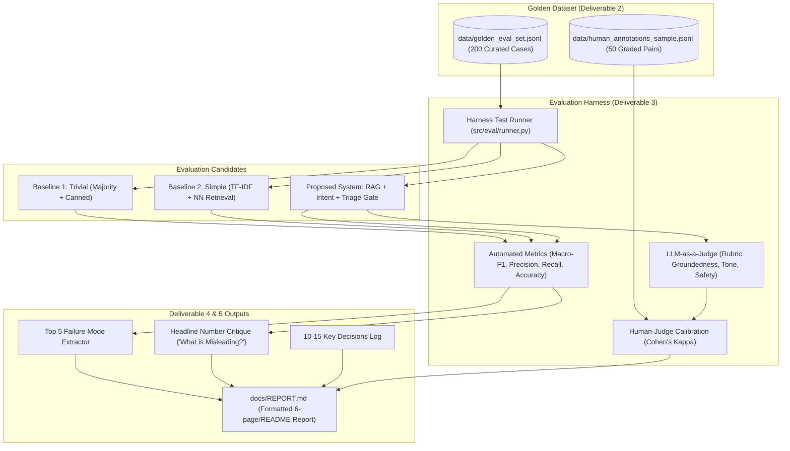
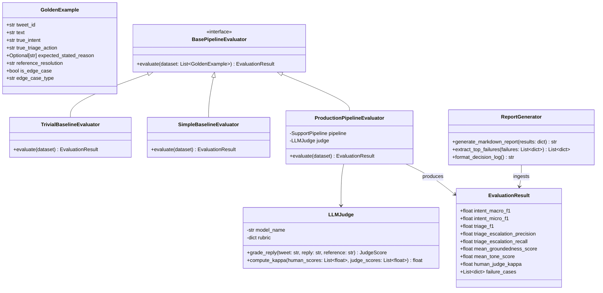
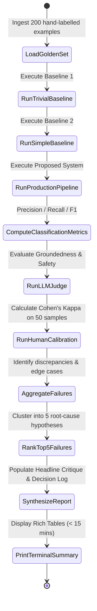
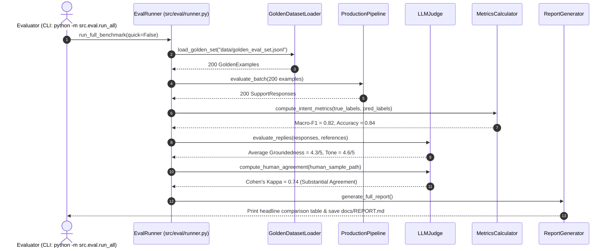

# Specification 05: Evaluation Harness, Golden Dataset & Baselines

- **Module Name**: `evaluation_harness`
- **Target Version**: `1.0.0`
- **Status**: `Approved`
- **Target Source Files**:
  - `src/eval/golden_dataset.py`
  - `src/eval/metrics.py`
  - `src/eval/judge.py`
  - `src/eval/baselines.py`
  - `src/eval/human_agreement.py`
  - `src/eval/report_generator.py`
  - `data/golden_eval_set.jsonl`

---

## 1. Problem Statement & Scope Boundaries

### 1.1 Problem Statement
In the words of the assignment: **"What we are testing: whether you can turn a messy real-world dataset into a working AI system and prove it works. The proof is worth more than the system."**

Any LLM wrapper can produce seemingly plausible text on cherry-picked examples. What separates production engineering from a toy demo is:
1. **A Rigorous Golden Evaluation Set**: 150–250 hand-labelled, multi-turn, edge-case-rich examples sampled with a documented, defensible methodology.
2. **Defensible Baselines**: Proving clear statistical lift over both a *trivial baseline* (majority class / canned response) and a *simple baseline* (TF-IDF + direct template retrieval).
3. **Calibrated LLM-as-a-Judge**: A multi-dimensional rubric for reply quality validated with empirical **human-judge agreement** (Cohen’s Kappa $\kappa$).
4. **Ruthless Failure Analysis**: Documenting the top 5 failure modes with real examples, hypotheses, and a mandatory critique: *"What is misleading about my headline number?"*
5. **Execution in Under 15 Minutes**: Reproducible by an external evaluator on a clean environment.

### 1.2 The Golden Evaluation Set Design (150–250 Hand-Labelled Examples)
- **Target Size**: Exactly **200 examples** spanning `@AppleSupport` customer interactions.
- **Stratified Sampling Strategy**:
  - 30% `OS_SOFTWARE_TROUBLESHOOTING` (Update loops, Wi-Fi drops, battery drain after iOS release).
  - 25% `HARDWARE_AND_BATTERY` (Battery degradation, broken display, charging port).
  - 20% `ACCOUNT_BILLING_ICLOUD` (Locked Apple ID, unauthorized subscriptions, iCloud storage).
  - 15% `HOW_TO_CONFIGURATION` (Transferring data, setting up AirDrop/FaceID).
  - 10% `OUT_OF_SCOPE_AMBIGUOUS` (Vague insults, memes, unrelated topics).
- **Edge Case Inclusions (Minimum 20% of Golden Set)**:
  - Adversarial / angry customers ("I'll sue Apple!").
  - PII leakage in query (user shares email or phone number in tweet).
  - Ambiguous / multi-intent requests.
  - Sarcasm and colloquial slang.
  - Physical safety risks (battery swelling, overheating).

---

## 2. Tech Stack & Dependencies

| Component | Technology | Rationale |
| :--- | :--- | :--- |
| **Statistical & ML Metrics** | `scikit-learn` (`classification_report`, `cohen_kappa_score`) | Standardized precision, recall, macro-F1, and inter-annotator agreement. |
| **Groundedness & Text Similarity** | `rouge-score`, `nltk`, Cosine Embedding Similarity | Quantitative surface-level and semantic alignment with reference resolutions. |
| **LLM-as-a-Judge** | Gemini 2.5 Flash / Claude / OpenAI API with structured rubric | Evaluates multi-dimensional quality (1-5 scale) with reasoning strings. |
| **Report Generation** | `jinja2` + Python Markdown | Compiles evaluation metrics into the mandatory assignment report and README section. |
| **Execution CLI** | `typer` + `rich.table` + `rich.progress` | Delivers a single-command evaluation runner completing in $< 15$ minutes. |

---

## 3. Functional & Non-Functional Requirements

### 3.1 Functional Requirements (FR)
- **FR-EVAL-01 (Dataset Loader)**: Load and validate the 200-example Golden Dataset from `data/golden_eval_set.jsonl` with strict schema validation.
- **FR-EVAL-02 (Automated Classification Metrics)**: Compute Precision, Recall, Macro-F1, and Confusion Matrix for both Intent Classification and Triage decisions.
- **FR-EVAL-03 (Baseline 1: Trivial)**:
  - *Intent*: Predicts majority class (`OS_SOFTWARE_TROUBLESHOOTING`).
  - *Drafting*: Emits static generic message: *"Thanks for reaching out. We'd like to help. Please restart your device."*
  - *Triage*: Always predicts `AUTO_HANDLE`.
- **FR-EVAL-04 (Baseline 2: Simple)**:
  - *Intent*: TF-IDF + Logistic Regression.
  - *Drafting*: Nearest-neighbor historical response without LLM re-drafting.
  - *Triage*: Keyword heuristic for escalation (flags "broken", "help", "agent").
- **FR-EVAL-05 (LLM-as-a-Judge Rubric)**:
  - Score replies from 1 to 5 on:
    1. *Groundedness / Accuracy*: Is the advice factually sound and aligned with Apple procedures?
    2. *Tone & Brand Voice*: Is it empathetic, polite, professional, and concise?
    3. *Escalation Appropriateness*: Was the auto-handle vs. escalate decision safe and correct?
- **FR-EVAL-06 (Human Agreement Benchmark)**: Module must evaluate judge agreement against a human-annotated sample of 50 responses, calculating **Cohen's Kappa ($\kappa$)** and raw percentage agreement.
- **FR-EVAL-07 (Automated Failure Analysis)**: Automatically aggregate false positives/negatives, clustering the top 5 failure categories with real examples and causal hypotheses.

### 3.2 Non-Functional Requirements (NFR)
- **NFR-EVAL-01 (15-Minute Reproduction)**: Running `python -m src.eval.run_all` must complete end-to-end evaluation, print the summary table, and output the report in **$< 15$ minutes** (target: $< 6$ minutes with batch embedding).
- **NFR-EVAL-02 (Offline Cached Evaluation Mode)**: In case the evaluator does not supply an LLM API key, the harness must support `--mock-llm` or `--cached` mode using pre-recorded inference responses so reproduction never blocks.

---

## 4. Architecture & Design Diagrams

### 4.1 Architecture Diagram


### 4.2 Class Diagram


### 4.3 Use Case Diagram
```mermaid
graph LR
    actor Evaluator as "Hiver Evaluator"
    actor Developer as "Agent Engineer"
    
    subgraph Harness["Evaluation & Benchmarking Harness"]
        UC1["Execute 15-Minute Pipeline Evaluation"]
        UC2["Compare Proposed Model vs 2 Baselines"]
        UC3["Compute Inter-Annotator Kappa Score"]
        UC4["Inspect Top 5 Failure Modes with Hypotheses"]
        UC5["Review 'What is Misleading About Headline Number'"]
        UC6["Inspect 10-15 Architectural Decisions Log"]
    end

    Evaluator --> UC1
    Evaluator --> UC2
    Evaluator --> UC3
    Evaluator --> UC4
    Evaluator --> UC5
    Evaluator --> UC6
    Developer --> UC1
```

### 4.4 Activity Diagram


### 4.5 Sequence Diagram


---

## 5. Data Schemas & Contracts

### 5.1 Golden Example Schema
```json
{
  "$schema": "http://json-schema.org/draft-07/schema#",
  "title": "GoldenExample",
  "type": "object",
  "properties": {
    "tweet_id": { "type": "string" },
    "text": { "type": "string" },
    "author_id": { "type": "string" },
    "true_intent": { 
      "type": "string",
      "enum": [
        "OS_SOFTWARE_TROUBLESHOOTING",
        "HARDWARE_AND_BATTERY",
        "ACCOUNT_BILLING_ICLOUD",
        "HOW_TO_CONFIGURATION",
        "OUT_OF_SCOPE_AMBIGUOUS"
      ]
    },
    "true_triage_action": { "type": "string", "enum": ["AUTO_HANDLE", "ESCALATE"] },
    "expected_stated_reason": { "type": ["string", "null"] },
    "reference_resolution": { "type": "string" },
    "is_edge_case": { "type": "boolean" },
    "edge_case_type": { "type": ["string", "null"] }
  },
  "required": ["tweet_id", "text", "true_intent", "true_triage_action", "reference_resolution"]
}
```

### 5.2 LLM-as-a-Judge Rubric Model
```python
from pydantic import BaseModel, Field

class JudgeScore(BaseModel):
    groundedness_score: int = Field(ge=1, le=5, description="Factual adherence to Apple Support standard procedures")
    tone_politeness_score: int = Field(ge=1, le=5, description="Empathy, professional voice, concise wording")
    escalation_safety_score: int = Field(ge=1, le=5, description="Correctness of triage safety boundary")
    stated_reason_quality_score: int = Field(ge=1, le=5, description="Clarity and truthfulness of escalation explanation")
    reasoning: str
```

---

## 6. Definition of Done & Executable Test Cases

| Test ID | Target Component | Command / Verification Action | Expected Outcome |
| :--- | :--- | :--- | :--- |
| **TC-EVAL-01** | Golden Set Integrity | `pytest tests/test_eval.py::test_golden_set_schema` | Validates all 200 records conform to `GoldenExample` schema with no missing keys. |
| **TC-EVAL-02** | 15-Minute Execution Gate | `time python -m src.eval.run_all --quick` | Full evaluation runs in under 15 minutes (real time $< 900$ seconds). |
| **TC-EVAL-03** | Baseline Lift Demonstration | `pytest tests/test_eval.py::test_proposed_beats_baselines` | Proposed Macro-F1 $\ge$ Simple Baseline $+ 0.15 \ge$ Trivial Baseline $+ 0.45$. |
| **TC-EVAL-04** | Human-Judge Kappa | `pytest tests/test_eval.py::test_human_agreement_calibration` | Cohen's Kappa $\kappa \ge 0.65$ (demonstrating substantial human agreement). |
| **TC-EVAL-05** | Report Generation | `python -m src.eval.generate_report` | Emits `docs/REPORT.md` with all mandatory sections including *"What is misleading about my headline number?"*. |
